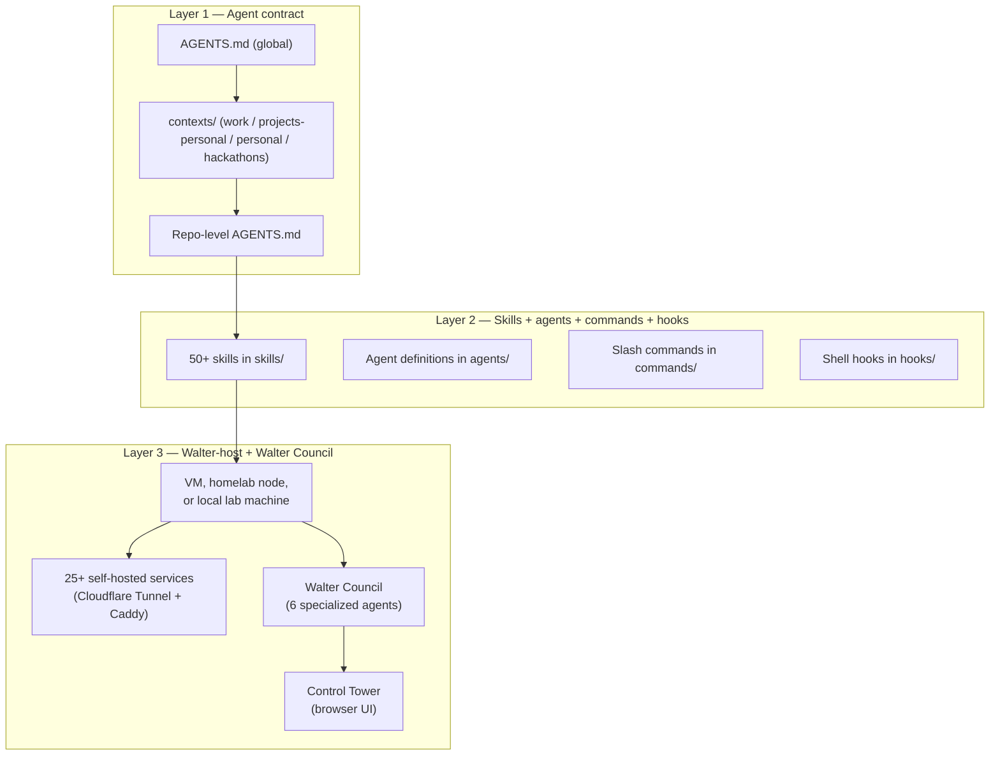
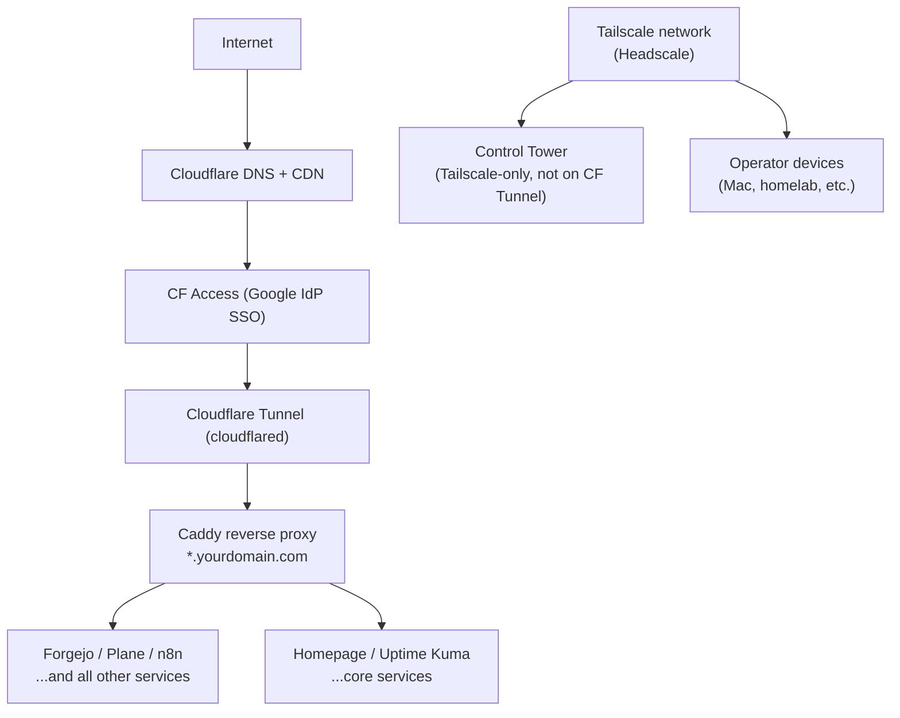
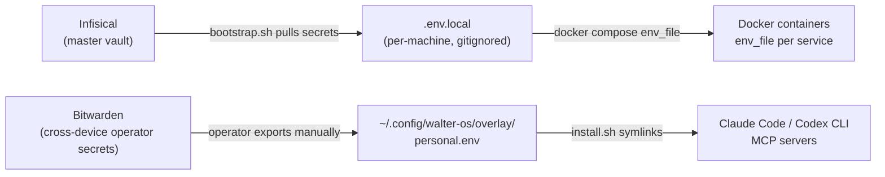

<div align="center">

<!-- TODO: replace with logo asset -->

# Walter-OS

**A self-hostable AI-agent operations framework by Xipher Labs**

[](#license)
[](https://github.com/xipher-labs/walter-os/actions/workflows/ci.yml)
[](CHANGELOG.md)
[](CHANGELOG.md)
[](docs/operational/network-egress.md)

</div>

---

Hi, I'm @f0x1777. I started Walter-OS as a personal operating system for
building software with AI agents. After using it across real projects, I saw
enough reusable value to open-source it through Xipher Labs, with the personal
pieces stripped out and the workflows hardened for other technical operators.
This release is still alpha, but the core idea is ready to study, fork, and
improve.

Walter-OS is an opinionated, single-repository operations framework that wires
Claude Code, Codex CLI, Cursor, and Google Antigravity together under the same
agent contract, the same skills catalog, and the same MCP configuration. All
four read `AGENTS.md` natively (Cursor + Antigravity ship adapter generators
too — `install.sh --cursor-rules` / `--antigravity-rules` — for environments
that prefer the per-tool mirror). A self-hosted service stack (`walter-host`)
is the optional fourth layer — most adopters never deploy it, and the agent
framework works fully without it. You fork the repo, apply a personal
overlay, and get a consistent AI-agent environment that follows you across
machines and tools.

**Walter-OS IS**: an agent contract layer (`AGENTS.md` + context files), a
curated skills library (80+ skills incl. the `obra/superpowers` plugin), a
default-deny security floor (`bash-denylist` + `approval-gate` + `network-gate`
in the PreToolUse chain — every outbound network call is blocked unless the
host is in the operator's allowlist), an `install.sh` with one-touch `--upgrade`
+ `--uninstall` (operator's pristine `.md` files are restored from the oldest
backup), a self-hosted service stack (25+ services in `setup/walter-host/`),
a Walter Council of six specialized agents, and an MCP catalog of 22 servers.

**Walter-OS IS NOT**: a zero-config starter kit you can `./install.sh` and
walk away from. It is not a stable API — this is alpha software with breaking
changes every sprint. It is not a generic agent framework; it has strong
opinions about workflow, branch flow, and rigor levels. It requires a personal
overlay before it does anything useful for you.

---

## Status: alpha — read this before relying on it

> **Current**: v0.5.1-alpha. Things iterate fast, things break, things get
> corrected on the fly. **Pin to a tag** if you depend on a specific
> behavior.
>
> **The v1.0 stability promise** is documented in
> [`docs/specs/walter-os-v1-0-stability-charter.md`](docs/specs/walter-os-v1-0-stability-charter.md).
> At v1.0, four layers will be frozen with a deprecation policy: the
> AGENTS.md cascade + env vars (Layer 1), the SKILL.md format (Layer 2),
> the `walter-os` CLI subcommands (Layer 3), and the
> `approval-gate`/`branch-flow-guard`/`network-gate` hook invariants
> (Layer 4). Everything else (service stack, MCP catalog, internal
> scripts, Council, Control Tower UI) is intentionally NOT frozen and can
> evolve freely. The conformance test suite at
> `tests/oss/conformance.bats` is the executable form of the charter.
>
> Until v1.0, breaking changes are normal — but every release is tagged
> and the CHANGELOG documents the diff.

### What's new in v0.5.x

**v0.5.1 — default-deny security floor + Antigravity + uninstall + Walter-VM
ops hardening** (12 merged PRs since v0.5.0; details in
[CHANGELOG.md](CHANGELOG.md)).

- **`#122` OSS Trust A-2 — default-deny network egress allowlist.**
  `hooks/network-gate.sh` blocks every outbound network call (curl,
  wget, git, gh, ssh, scp, rsync, nc, pip, npm, uvx, cargo, brew,
  gem, go + git extensions lfs/svn/annex/p4) unless the target host
  is in `~/.config/walter-os/egress-allowlist.txt`. New
  `walter-os egress {add,remove,list,test,import}` CLI;
  `install.sh` offers a one-touch import of the bundled allowlist.
  Token-aware two-factor bypass for emergencies. Full guide at
  [`docs/operational/network-egress.md`](docs/operational/network-egress.md).
- **`#190` Antigravity adapter** (`install.sh --antigravity-rules`)
  — sibling of the Cursor adapter. Generates a project-local
  `.agent/rules/walter-os.md` from `AGENTS.md` with an
  `agents-md-sha256` trailer for `walter-os doctor --antigravity`
  to detect drift.
- **`#191` Uninstall + backup restore.** `install.sh --uninstall`
  and `walter-os uninstall` remove the symlinks AND restore the
  OPERATOR'S PRISTINE pre-Walter-OS `.md` files from the OLDEST
  `.pre-walter-os.<ts>` backup. Naming switched to ISO-8601 UTC
  so the oldest-by-name is the oldest-by-time. Non-TTY default is
  SAFE (skip-restore + print the manual `mv` command — never
  silently delete operator backups).
- **Walter-VM ops triage wave (#174 / #176 / #195 / #172 / #183 /
  #189 / #186 / #187).** Cloudflared tunnel routes ALL Caddy
  subdomains via Caddy from a single source-of-truth array;
  Control Tower image bundles the walter-os CLI so the Council
  toggle works; CT HA-status uses `/api/instances/` (Plane
  returns 404 on `/api/health`); postiz pinned to v2.20.2
  pre-Temporal; LiteLLM tile false-unreachable fixed (CF Access
  auth gap); review-loop composite Action emits a stable
  `rounds-completed` JSON contract + mounts Codex CLI auth
  properly; CLA gate pinned by SHA.

**v0.5.0 — OSS-readiness milestone** (15 merged PRs since v0.4.5).
Dual-license posture (Apache-2.0 default + AGPL-3.0-or-later for
`setup/walter-host/`, per ADR-0018), CLA scaffold (ADR-0019),
Xipher Labs S.R.L. legal entity attribution (ADR-0022), v1.0
stability charter conformance suite, AGENTS.md cascade published as
a vendor-neutral RFC, Cursor adapter, Walter-OS Lite zero-friction
entry tier, 3-round review loop packaged as a reusable composite
GitHub Action, Control Tower login-redirect production fix.

**v0.4.x and earlier**: see [CHANGELOG.md](CHANGELOG.md).

### What this means for adopters

- **Breaking changes are normal until v1.0.** Pin to a specific commit or
  tag in production. Read the CHANGELOG before pulling.
- **IaC idempotency is the goal**, not always the reality. Some bootstrap
  sequences may need a second `./install.sh` invocation or a
  `docker compose up -d` retry. We're tightening this every release.
- **The framework is opinionated by design.** The opinions came from one
  operator's daily workflow. We've stripped operator-personal config
  (personal-overlay scaffolding lives in `~/.config/walter-os/overlay/`
  under your control, not in the repo) but some opinions persist (TDD
  discipline, branch flow, 3-round review, dual-license). If they don't
  fit your style, fork + diverge.
- **Cross-compatibility is best-effort.** Tested primarily on macOS (Apple
  Silicon) + Hetzner Cloud Ubuntu 24.04. Linux dev workstations should work;
  Windows / WSL is unverified. Other cloud providers are documented as
  alternatives but only Hetzner is the reference deployment.
- **Issues and PRs are appreciated.** Especially for: reproducible bugs on
  non-reference platforms, depersonalization leaks we missed, security
  findings, doc gaps that confused you the first time. See
  [CONTRIBUTING.md](CONTRIBUTING.md) for the convention.
- **Security disclosures are private.** See [SECURITY.md](SECURITY.md) — do
  not file public issues for vulnerabilities.

If you want a polished, stable, support-contracted agent framework, this
isn't it yet. If you want to see how one operator runs ten products with AI
at the wheel and learn the discipline they enforce — and contribute back —
you're in the right place.

---

## What is Walter-OS?

Walter-OS is deliberately split into two parts:

- **walter-os (client framework)** — the local agent operating layer for your
  workstation. It provides the `AGENTS.md` cascade, contexts, skills, commands,
  hooks, the `walter` CLI, MCP profiles, and Walter Council agent definitions.
  **It does not require a VM.**
- **walter-host (`setup/walter-host/`)** — an optional self-hosted service stack
  for a server, VM, homelab node, or local lab machine. It provides services
  such as Infisical, LiteLLM, Plane, Forgejo, Grafana, n8n, Syncthing, and
  Control Tower.

You can adopt those parts in four ways:

| Mode | What you do | What you get | Why it exists |
|---|---|---|---|
| **1. Clone-only reference** | Clone the repo and read/copy from it. Do not run `install.sh`. | The agent contract, workflow rules, skills, docs, specs, hooks, and service recipes as plain files. | Useful when you only want to study the operating model, copy an `AGENTS.md` pattern into another repo, audit the system before trusting it, or use Walter-OS as a playbook without changing your machine. |
| **2. Client install** | Run `./install.sh` on your workstation and configure a personal overlay. | A consistent agent environment across repos: same global/context/repo `AGENTS.md` cascade, same skills catalog, same commands, same hooks, same MCP profiles, same CLI. | This is the default starting point. It makes Claude Code, Codex CLI, and repo-level agents behave consistently without asking you to self-host anything. Cursor reads `AGENTS.md` natively in recent versions; older Cursor versions or operators who want the rules visible in the IDE rules panel can opt in to a generated MDC file with `./install.sh --cursor-rules`. Antigravity v1.20.3+ also reads `AGENTS.md` natively; operators who want a stable per-tool mirror can opt in to `./install.sh --antigravity-rules` (generates `<repo>/.agent/rules/walter-os.md`). |
| **3. Client + selected services** | Keep the client install, then add only the services you need from `walter-host` or from existing SaaS. | Targeted upgrades such as Infisical for better secrets control, LiteLLM for model routing and spend visibility, Grafana for observability, Syncthing for memory/file sync, or n8n for automation. | Most operators do not need the full stack on day one. This lets you add control where it matters while keeping GitHub/Linear/hosted tools where they already work. |
| **4. Full walter-host** | Deploy the self-hosted stack on a VM, homelab node, or local lab machine. | A complete operator control plane: secrets vault, model gateway, project tracker, git host, dashboards, automations, backups, and Control Tower for supervising agent activity. | This is for operators who want stronger data ownership, reproducible service wiring, human-visible agent telemetry, and a private backend for longer-running Council workflows. |

The stack is built this way because the useful part should start small. You can
use the repo as a reference with no install, install only the client to make
agents behave consistently across every repo, and then add self-hosted services
only when the additional control is worth the operational cost.

Once installed, Walter-OS becomes the agent-behavior baseline for the tools you
choose to wire into it. `install.sh` symlinks the global contract, skills,
agents, commands, hooks, and MCP profiles into the local tool homes used by
Claude Code and Codex CLI. Recent Cursor versions read `AGENTS.md` natively,
so the same cascade applies there without extra wiring; operators who want the
rules visible in Cursor's "Rules for AI" panel or who use an older Cursor
version can opt in to a generated `.cursor/rules/walter-os.mdc` by running
`./install.sh --cursor-rules`. The goal is not to force a new editor; it is
to make the same operating discipline available wherever you ask an agent to
work.

That discipline is loaded as a three-level `AGENTS.md` cascade:

1. **Global layer** — Walter-OS's root `AGENTS.md`: shared philosophy, task
   rigor, branch flow, review loop, safety gates, tool preferences, and default
   skills.
2. **Context layer** — a parent-directory working mode such as `work`,
   `projects-personal`, `personal`, or `hackathons`, selected from cwd or
   `WALTER_CONTEXT` and optionally overridden by your private overlay.
3. **Repository layer** — the current repo's own `AGENTS.md`, where project
   constraints, stack-specific rules, and local Definition of Done live.

Conflicts resolve most-specific-wins: repo > context > global. This is what lets
Walter-OS keep a consistent agent philosophy while still allowing each repo to
override the parts that must be local.

`walter-host` is not a requirement for Walter-OS. It is the optional control
plane that increases leverage: Infisical centralizes secrets instead of spreading
tokens across shell files, LiteLLM gives one model gateway with spend/audit
visibility, Grafana and Control Tower make agent activity visible to the human
operator, and Plane/Forgejo/n8n provide private workflow surfaces for agents to
work against.

See `docs/operational/walter-os-vs-walter-host.md` for the full breakdown,
trade-offs, and which mode is right for your situation.

---

## Architecture overview

Walter-OS is three layers stacked on top of each other:



**Layer 1 — Agent contract**: `AGENTS.md` is the single source of truth read
by Claude Code, Codex CLI, and Cursor. It cascades from global (this file) →
context (cwd-driven) → repo-level. Conflicts resolve most-specific-wins.
The personal overlay at `~/.config/walter-os/overlay/` lets you override any
template file without touching the repo.

**Layer 2 — Skills + agents + commands + hooks**: skills are `SKILL.md` files
that describe a repeatable methodology (brainstorming, TDD, PR review). Agents
are subagent definitions that run as fresh-context Claude instances. Commands
are slash commands (`/brainstorm`, `/write-plan`, `/execute-plan`). Hooks are
shell scripts that run at key points in the git and Claude Code lifecycle
(pre-commit, branch-flow guard, daily supply-chain audit).

**Layer 3 — Walter-host + Walter Council**: walter-host runs the
self-hosted services stack on a VM, homelab node, or local lab machine.
walter-host is optional for Tier I-II (agent contract + skills + MCPs
work without it), but **the autonomous Walter Council DOES require
walter-host** for LiteLLM (model gateway) + Plane (work queue) — see
the "Service dependencies" section under Walter Council below for the
honest coupling. The Walter Council is six specialized agents (triage,
researcher, coder, reviewer, janitor, liaison) that work on Plane issues
autonomously. Control Tower is the browser UI for monitoring and
directing the Council.

---

## Walter Council

The Walter Council is a set of six specialized agent definitions in `agents/`
that work together on longer-horizon tasks without requiring the operator's
constant attention. Each agent runs as a fresh-context Claude instance with
read/write access scoped to its role.

| Agent | Role | Trust tier | Auto-approved actions |
|---|---|---|---|
| **triage** | Reads new GitHub/Plane issues, labels, assigns, creates specs | medium | Create Plane issue, write spec draft |
| **researcher** | Web search, competitive analysis, document summarization | medium | Read files, web search, write notes |
| **coder** | Implements tasks from approved specs following TDD discipline | medium | Write files on `feature/*`, run tests |
| **reviewer** | Reviews PRs: bugs, security, edge cases; no write tools | high | Read files only |
| **janitor** | Dependency updates, dead code removal, lint fixes | low | Write files on dedicated branch |
| **liaison** | Drafts external communications (emails, social posts, docs) | low | Write draft files |

Trust tiers control which `approval-gate.sh` decisions auto-approve vs require
operator review. The blocked-for-all-tiers list (push to main/staging, merge
PRs, modify hooks/AGENTS.md) is hardcoded in `hooks/approval-gate.sh` and
cannot be overridden by any tier.

Council configuration lives in `agents/`. Trust tier assignments are in
`~/.config/walter-os/trust-tiers.yml` (generated by `install.sh`).

### Service dependencies (be honest about the coupling)

The Walter Council is **only fully functional on Tier IV** (full
walter-host install). The Council's automation depends on two
walter-host services:

- **LiteLLM** (`COUNCIL_LITELLM_KEY`) — routes Council agents through a
  shared model gateway with spend tracking and per-agent rate limits.
  The triage/researcher/coder agents in particular call LiteLLM directly
  for the heavy model traffic.
- **Plane** (`COUNCIL_PLANE_TOKEN`) — the Council's work queue. The
  triage agent reads new issues from Plane; the coder agent picks up
  approved specs from Plane; the reviewer agent posts review notes
  back to Plane.

This means: **without walter-host, the Council does not run end-to-end.**
You can still copy individual agent definitions from `agents/` and use
them as Claude Code subagents (`Agent({ subagent_type: "reviewer", ... })`
in your own scripts), but the autonomous-multi-step Council loop needs
the services.

If you want the agent-discipline contract without walter-host, stop at
Tier II (skills + MCP profiles + slash commands). Tier I-II are
genuinely walter-host-free.

A "Council-Lite" that runs without LiteLLM/Plane (using hosted
alternatives like OpenRouter + GitHub Issues or Linear) is tracked as a
follow-up but not in the current scope — the design trade-off is
deferred until there's demand. See issue #157.

For the full Council design, see
`docs/specs/walter-council-v2.md` and
`docs/decisions/0009-agent-trust-tiers.md`.

---

## Skills catalog

Walter-OS ships 50+ skills. Skills are Markdown files (`SKILL.md`) that
describe a repeatable methodology. The agent reads the skill file when the
skill is triggered (by name match or explicit invocation) and follows the
workflow described.

### From `obra/superpowers` (required plugin)

These skills ship with the superpowers plugin. Walter-OS assumes they are
installed.

| Skill | Triggered by |
|---|---|
| `brainstorming` | `/brainstorm` command or "brainstorm" in task description |
| `writing-plans` | `/write-plan` command |
| `executing-plans` | `/execute-plan` command |
| `test-driven-development` | Any implementation task; enforces RED-GREEN-REFACTOR |
| `systematic-debugging` | "debug", "failing test", "can't reproduce" |
| `root-cause-tracing` | "root cause", "intermittent failure" |
| `verification-before-completion` | Before any PR creation |
| `using-git-worktrees` | Multi-agent parallel work |
| `code-reviewer` | PR review requests |
| `defensive-programming` | Security-sensitive code paths |

### Walter-OS native skills

| Skill | Purpose |
|---|---|
| `nanobanana` | Image generation via Gemini API |
| `daily-supply-chain-audit` | Daily MCP/skill security scan + NVD CVE check |
| `pr-review` | Walter-OS-specific PR checklist |
| `definition-of-done-validator` | Maps spec ACs to tests; blocks PR if uncovered |
| `ai-spend-tripwire` | Guardrail on LLM API spend per session |
| `hackathon-spinup` | 48h project orchestration: brand → landing → MVP → demo |
| `brand-creation` | Logo, palette, identity pipeline via Gemini |
| `project-induction` | Guided new-project interview → charter + spec + Plane epic |
| `web-security-baseline` | Security checklist for web-exposed services |
| `frontend-quality` | React/Next.js quality gate |
| `data-migration-safety` | Postgres migration review discipline |
| `regulatory-research-international` | Multi-jurisdiction regulatory lookup |
| `medical-data-compliance` | PHI/HIPAA/GDPR guardrails for health data |
| `landing-page-fast` | Rapid landing page scaffold with Astro + Tailwind |
| `readme-craft` | Opinionated README authoring — picks section template per project type, curates upstream tools from `awesome-readme-tools` |

#### Founder-skills bundle (v0.4.0)

A six-skill bundle for the operator who's the entire founding team:
five domain skills (`track-pending`, `legal-doc-review`,
`terms-policy-generator`, `financial-plan-builder`, `hiring-toolkit`)
plus the `founder-skills` index — both an index document
and an invokable skill the agent activates to navigate the bundle.
See [`skills/founder-skills/INDEX.md`](skills/founder-skills/INDEX.md)
for the composition workflows (e.g. "open a new role", "launch a
public-facing service", "monthly financial review").

| Skill | Purpose |
|---|---|
| `track-pending` | `walter-pending.md` ledger convention — track operator-blocking decisions across sessions |
| `terms-policy-generator` | Terms / Privacy / Cookies drafts from a single YAML config |
| `legal-doc-review` | 12-clause contract triage with red-flag detection |
| `financial-plan-builder` | 12-month cash projection from a YAML revenue / expense model |
| `hiring-toolkit` | Job description + interview rubric + offer template |

Skills auto-trigger based on description match. You can also invoke them
explicitly by name: "apply the `hackathon-spinup` skill to this project."

---

## MCP catalog

Walter-OS manages MCP configuration profiles via `install.sh` (writes to
`~/.claude/`). The canonical registry is [`mcp/servers.json`](mcp/servers.json)
— 22 servers as of v0.5.1. The default-vs-high-risk profile separation
is **in flight**: today every server in the JSON ships in the default
profile; the `risk_class` annotations are being filled in across the
2026-Q2 OSS Trust epic so the next minor release can ship a true
default-only profile + a manual high-risk profile.

### Default profile (22 servers, auto-loaded)

Loaded in every Claude Code session.

| Category | MCPs |
|---|---|
| **Dev tools** | `github`, `forgejo`, `sentry`, `playwright`, `maestro` |
| **Project management** | `linear`, `plane` |
| **Storage** | `filesystem`, `supabase` |
| **Communication** | `slack`, `gmail` |
| **Productivity** | `google_calendar`, `google_drive`, `notion` |
| **AI / infra** | `sequential_thinking`, `memory`, `brave_search` |
| **Design** | `penpot` |
| **Observability** | `grafana`, `elevenlabs` |
| **Risk-class flagged (already in JSON, planned for manual profile)** | `bitwarden`, `cloudflare`, `stripe` |

### Manual profile (planned — not yet in `mcp/servers.json`)

Destructive / money-spending / lateral-movement-risk servers an operator
opts in to per-session. Today these live OUTSIDE the canonical JSON;
operators who want them install via their personal overlay's MCP config.
The planned set: `hetzner` (VM provisioning), `vercel` (production
deploys), `railway` (service lifecycle), plus the JSON-flagged
`bitwarden` / `cloudflare` / `stripe` once profile separation lands.

When the profile separation ships, the switch sequence will be:

To switch to the manual profile:

```bash
walter-os profile high-risk         # swap to manual MCP profile
# ... do high-risk work (provisioning, money-spending, prod deploys) ...
walter-os profile default           # swap back
```

(The underlying mechanism is a settings.json swap — `walter-os help
profile` documents the manual `mv` form.)

---

## Repo structure

```
walter-os/
├── AGENTS.md                    # Global agent contract (loaded by all tools)
├── CHANGELOG.md                 # Semver changelog
├── VERSION                      # Single-source semver (0.5.1)
├── LICENSE                      # AGPL-3.0-or-later (canonical text)
├── LICENSE-APACHE               # Apache-2.0 (canonical text — default tree)
├── NOTICE                       # Operator attribution + dual-license map
├── COMMERCIAL.md                # Entry point for commercial-license requests
├── agents/                      # Walter Council agent definitions
├── apps/
│   └── control-tower/           # Next.js 16 Council UI (docker build'd)
├── bin/                         # walter-os CLI + sibling walter CLI
├── commands/                    # Slash commands (/brainstorm, /write-plan, /execute-plan)
├── contexts/
│   ├── work/AGENTS.md                   # Work context template
│   ├── projects-personal/AGENTS.md      # Personal dev context template
│   ├── personal/AGENTS.md               # Life context template
│   ├── hackathons/AGENTS.md             # Hackathons (WALTER_CONTEXT=hackathons)
│   └── _examples/                       # Reference operator overlays (incl.
│                                        # egress-allowlist.example.txt)
├── docs/
│   ├── decisions/               # ADRs (numbered NNNN-<slug>.md)
│   ├── operational/             # Runbooks, audits, operator guides
│   └── specs/                   # Feature specs + implementation plans
├── external/
│   ├── marchetto-agent-skills/  # Submodule — additional skills (SHA-pinned)
│   └── vercel-agent-skills/     # Submodule — additional skills (SHA-pinned)
├── hooks/                       # PreToolUse chain: bash-denylist, approval-gate,
│                                # network-gate, branch-flow-guard, pre-commit-tests
├── install.sh                   # Symlinks + writes ~/.claude/settings.json hook chain;
│                                # --upgrade / --uninstall / --cursor-rules /
│                                # --antigravity-rules / --check / --dry-run
├── mcp/
│   └── servers.json             # Canonical MCP registry (22 servers as of v0.5.1)
├── scripts/                     # Bootstrap + maintenance scripts;
│   └── walter/lib/              # Shell libs sourced by hooks (env-loader,
│                                # egress-loader, version-compare, …)
├── setup/
│   ├── walter-host/             # Self-hosted service stack (Cloudflare Tunnel,
│   │                            # per-service compose files, Caddy, …)
│   ├── agent-install/           # Tier I-IV install playbooks for agent-led setup
│   └── <per-service>/           # caddy/, grafana/, headscale/, plane/, postgres/,
│                                # prometheus/, walter-bridge/, … (operator overlays
│                                # for the homelab stack)
├── skills/                      # Walter-OS native skill library (~85 skills)
├── tests/                       # bats suites
│   ├── audit/                   # Supply-chain audit tests
│   ├── cli/                     # walter-os subcommand tests
│   ├── hooks/                   # PreToolUse hook tests (incl. network-gate)
│   ├── install/                 # install.sh flow tests
│   ├── oss/                     # OSS-specific (depersonalization, structure,
│   │                            # license-files, conformance to v1.0 charter)
│   └── walter/                  # scripts/walter/lib/* tests
└── wiki/                        # Internal wiki (frontmatter-validated)
```

The `install.sh` script symlinks `skills/`, `agents/`, `commands/`, and
`hooks/` into `~/.claude/` and `~/.codex/`, and registers the PreToolUse
hook chain in `~/.claude/settings.json`. Run it on every machine where
you use Claude Code or Codex CLI.

---

## Disciplines overview

Walter-OS enforces these disciplines universally — across all contexts, all
projects, all tools.

### Rigor levels

Every task is classified before work begins:

| Level | Criteria | Plan required | Tests |
|---|---|---|---|
| **tiny** | Typo, single-line config, dep bump, comment | None | Lint + typecheck |
| **small** | Bug fix < 50 LOC, single function | 2-3 sentences in commit body | RED-GREEN-REFACTOR |
| **major** | New feature, schema change, > 200 LOC, auth/money/PHI path | Spec in `docs/specs/` + plan | Full TDD + DoD validator |

Auto-escalate to **major** (regardless of LOC) for: any change in `auth/`,
`crypto/`, money flows, PHI data, DB migrations in production, changes to
`hooks/`, `AGENTS.md`, `install.sh`, or `mcp/servers.json`.

### Branch flow

Configurable via `WALTER_BRANCH_FLOW` in your overlay. Default
(`single-tier`) is `feature/<slug>` → `main`. Set
`WALTER_BRANCH_FLOW=three-stage` in
`~/.config/walter-os/overlay/personal.env` to opt in to the
`feature → dev → staging → main` flow for teams with a real
staging environment.

Direct push to `main` (or `master`, `staging`, `production` if those
branches exist) is blocked unconditionally by
`hooks/branch-flow-guard.sh` regardless of mode. See
`docs/decisions/0013-solo-operator-merge-policy.md` for the
trade-offs.

### Definition of Done

A task is not done until:
- Spec exists at `docs/specs/<slug>.md` and acceptance criteria are current
- Every AC has a test referencing it by ID (e.g., `[AC-1]` in test description)
- All tests pass: unit + integration + e2e + DoD validator
- Lint + typecheck + format clean
- Security scan clean (`npm audit`, `cargo audit`, or equivalent)
- Build clean
- Reviewer subagent has approved

The `definition-of-done-validator` skill enforces the AC-to-test mapping before
PR creation.

### Commit format

```
<type>(<scope>): <imperative summary, ≤72 chars>

<body: why, not what>

Refs: docs/specs/<slug>.md
Closes <PROJ-NNN>
```

Types: `feat`, `fix`, `chore`, `docs`, `refactor`, `test`, `perf`, `security`.

### Security floor (PreToolUse chain)

Every Bash command an agent issues passes through five hooks in order:

| Hook | Question it answers |
|---|---|
| `bash-denylist.sh`    | Is this an RCE pattern (`curl X \| bash`, `eval $VAR`, `bash -c "$(…)"`, `rm -rf /`)? |
| `approval-gate.sh`    | Does this destructive op need operator confirmation under the trust-tier matrix? |
| `network-gate.sh`     | Is the target host in `~/.config/walter-os/egress-allowlist.txt`? (Default-deny.) |
| `branch-flow-guard.sh`| Does this push violate the configured branch flow (`single-tier` vs `three-stage`)? |
| `pre-commit-tests.sh` | Do tests + lint + typecheck still pass before the commit? |

All five must allow before a command runs. Each hook is fail-CLOSED on
parse errors, missing dependencies, or unexpected input — a partial
install never leaves the gate open. Operator guide:
[`docs/operational/network-egress.md`](docs/operational/network-egress.md).

---

## Quick start (mode 2 — client install)

If you only want to evaluate Walter-OS as a reference, stop after cloning and
read the repo. Nothing outside the clone changes until you run `install.sh`.

```bash
git clone https://github.com/xipher-labs/walter-os.git /opt/walter-os && cd /opt/walter-os
./install.sh --check               # verify minimum local requirements
./install.sh --dry-run             # preview all writes before touching your config
./setup/personal-overlay-init.sh   # scaffold ~/.config/walter-os/overlay/
./install.sh --upgrade             # install/refresh local symlinks, hooks, MCP configs
```

This gives you the local agent contract, skills, CLI, and overlay structure.
It is the mode that makes agents behave consistently across repositories once
the global/context/repo `AGENTS.md` cascade and symlinked skills are installed.
Claude Code and Codex CLI pick up the symlinked Walter-OS contract and skills.
Recent Cursor versions read `AGENTS.md` natively — no extra step. For older
Cursor versions or to materialize the rules in Cursor's IDE rules panel, opt
in with `./install.sh --cursor-rules` (generates `<repo>/.cursor/rules/walter-os.mdc`).
The optional self-hosted service stack is a separate step:

```bash
docker compose up -d               # after configuring .env.local
```

See [Requirements](docs/operational/requirements.md) and
[Step-by-step installation](#step-by-step-installation) for the full sequence
with DNS, Cloudflare Tunnel, secrets bootstrap, and Control Tower build.

---

## Install via agent (Lite → Tier I → IV)

### Walter-OS Lite — start here

> **Start here. No install. 30 seconds.**

Paste the fenced block from [`setup/agent-install/lite.md`](setup/agent-install/lite.md)
into a Claude Code or Codex CLI conversation. Your agent adopts the
minimum Walter-OS disciplines (rigor classification, TDD gate, conventional
commits, branch flow, self-review, hard nevers) for that session. No
prerequisites. No file changes. No tools required.

Ready to make it stick across all future sessions in this repo (still
without `install.sh`)? Paste [`setup/agent-install/lite-persist.md`](setup/agent-install/lite-persist.md)
after Lite — it writes `.walter-os-lite/AGENTS.md` to the current repo and
adds the directory to `.gitignore`. Verify with `walter-os doctor --lite`.

Ready to make it permanent (across all your repos, with the full agent
contract — skills, hooks, MCP profiles, CLI)? Continue to Tier I below.

### Tier I → IV — full install

Don't want to memorize steps? Walter-OS ships four copy-paste prompts
you hand to your agent (Claude Code, Codex CLI, or Cursor). The agent
reads the prompt, asks the minimum questions, writes the config files,
and verifies each step before moving on.

Tiers stack — start small and upgrade later without redoing earlier
work.

| Tier | What you get | Time | Cost/mo | Prompt |
|---|---|---|---|---|
| **I — Agent contract** | `AGENTS.md` cascade + personal overlay + hooks + `walter-os` CLI symlinked to `~/.local/bin/` | ~5 min | $0 | [`setup/agent-install/tier-1.md`](setup/agent-install/tier-1.md) |
| **II — + Local tooling** | Tier I + skills catalog (~50) + MCP profiles + slash commands + `obra/superpowers` plugin | ~15 min | $0 | [`setup/agent-install/tier-2.md`](setup/agent-install/tier-2.md) |
| **III — + Self-hosted stack** | Tier II + Hetzner VM + 25 services (Plane, Forgejo, Grafana, n8n, Infisical, LiteLLM, …) behind Cloudflare Access | ~1–2 hrs | ~€25–50 | [`setup/agent-install/tier-3.md`](setup/agent-install/tier-3.md) |
| **IV — + Council + automation** | Tier III + 6-agent Walter Council with per-agent trust tiers + n8n workflows + Plane workspace structure + Control Tower (`--profile tier4`) | ~2–3 hrs | +~$10–50 LLM | [`setup/agent-install/tier-4.md`](setup/agent-install/tier-4.md) |

**How to use**: open your agent in any directory, paste the entire
fenced block from the chosen tier file, answer questions one at a
time. Prompts are idempotent — re-paste to upgrade tiers, rotate
keys, or add things you skipped. Verification at every step uses
`walter-os doctor --tier N`.

**Ground rules baked into every tier prompt**:
- One question at a time; defaults explained.
- Diffs shown before writes.
- Verify after every step; stop on errors.
- Conversation in your language; code/paths in English.
- Tier III's money-spending actions print the bill and require
  explicit per-action confirmation.

If you'd rather follow steps manually, the [Quick start](#quick-start-mode-2--client-install)
above and the [Step-by-step installation](#step-by-step-installation)
below cover the same ground without an agent.

---

## Table of contents

- [Install via agent (Lite → Tier I → IV)](#install-via-agent-lite--tier-i--iv)
- [Personas](#personas)
- [Stack at a glance](#stack-at-a-glance)
- [Networking and access](#networking-and-access)
- [Secrets flow](#secrets-flow)
- [Multi-device strategy](#multi-device-strategy)
- [Resource budget](#resource-budget)
- [Step-by-step installation](#step-by-step-installation)
- [Customization patterns](#customization-patterns)
- [Walter-Bridge and CLI clients](#walter-bridge-and-cli-clients)
- [Operator contexts at a glance](#operator-contexts-at-a-glance)
- [n8n workflows](#n8n-workflows)
- [Updating](#updating)
- [Troubleshooting](#troubleshooting)
- [Contribution](#contribution)
- [Security](#security)
- [License](#license)

---

## Personas

Walter-OS is built for three primary personas. Read carefully — the "NOT for
you" sections are as important as the "for you" sections.

### Builder — solo engineer, shipping product fast

**This is for you if:**
- You write code most of the day and context-switch between multiple tools
  (Claude Code, Codex CLI, Cursor, terminal).
- You want your AI agents to follow the same disciplines everywhere — same
  branch flow, same commit format, same rigor levels — without configuring
  each tool separately.
- You self-host at least some services (Postgres, Forgejo, Plane) and want
  them wired into your agent's MCP catalog automatically.

**This is NOT for you if:**
- You want a no-configuration experience. Every service requires first-run
  setup; the personal overlay is mandatory.
- You need enterprise features: SSO beyond Google IdP, RBAC, audit trails
  for compliance. Walter-OS has none of that.
- You are not comfortable with Docker, DNS configuration, and Linux sysadmin
  basics.

Relevant context: `contexts/projects-personal/`

---

### Founder — pre-PMF, needs GTM tooling without a DevOps hire

**This is for you if:**
- You want a self-hosted PostHog, Postiz, n8n, and Metabase stack without
  paying $300+/mo for SaaS equivalents.
- You want AI agents that can help you with content publishing, analytics
  workflows, and competitive research — all routed through your own LiteLLM
  gateway with cost visibility.
- You are comfortable spending a one-time 4–8 hour setup window to get a
  permanent GTM stack that you own.

**This is NOT for you if:**
- You need uptime SLAs. This is a single-VM setup; if the VM goes down, your
  services go down.
- You are looking for a managed SaaS replacement with customer support.
- Your team has more than 2–3 people. Walter-OS is designed for solo or
  micro-team use; multi-user access requires manual Plane/Forgejo user
  management.

Relevant contexts: `contexts/projects-personal/`, `contexts/work/`

---

### Operator — homelab enthusiast, life-OS

**This is for you if:**
- You want Syncthing, Headscale, Synapse/Element, and Grafana in one
  composable stack.
- You think of your VM as an "always-on personal brain" — project management
  (Plane), git hosting (Forgejo), secrets vault (Infisical), and AI gateway
  (LiteLLM) all in one place.
- You want your AI tools to respect privacy: secrets stay on your VM,
  medical/PHI data stays on a local LLM, and you control routing decisions.

**This is NOT for you if:**
- You want a NAS-first setup. Walter-OS has SeaweedFS as an optional service
  but is not a primary NAS solution.
- You want automatic zero-downtime updates. Updates are manual (pull, rebuild,
  compose up).
- You need mobile-first management. There is no Walter-OS mobile app; the
  Control Tower browser UI is the management surface.

Relevant context: `contexts/personal/`

---

### Hackathon participant — brief mention

Walter-OS ships a `contexts/hackathons/` context (added by the
operator-contexts PR — see [Operator contexts at a glance](#operator-contexts-at-a-glance))
with a PROMPT.md template optimized for 48h sprint mode: brand → landing →
MVP → demo. The `hackathon-spinup` skill orchestrates the full sequence.
Hackathon use does not require the full VM stack; you can run Walter-OS
purely as the agent contract layer on your laptop.

---

## Stack at a glance

> RAM budget values are typical RSS under moderate load, not hard container
> limits. Actual usage varies significantly with usage patterns.

| Service | What it does | Hostname | Profile | RAM budget | Docs |
|---|---|---|---|---|---|
| **Homepage** | Dashboard / service tiles | `home.yourdomain.com` | core | ~128 MB | `setup/walter-host/services/homepage/` |
| **Forgejo** | Self-hosted Git + CI runner | `git.yourdomain.com` | core | ~256 MB | `setup/walter-host/services/forgejo/` |
| **Plane** | Project management + issue tracker | `plane.yourdomain.com` | core | ~512 MB | `setup/walter-host/services/plane/` |
| **Infisical** | Secrets vault (runtime + operator) | `secrets.yourdomain.com` | core | ~512 MB | `setup/walter-host/services/infisical/` |
| **LiteLLM (Walter-Bridge)** | AI model gateway (37 aliases across 17 providers) | `bridge.yourdomain.com` | core | ~256 MB | `setup/walter-host/services/litellm/` |
| **n8n** | Workflow automation | `n8n.yourdomain.com` | core | ~512 MB | `setup/walter-host/services/n8n/` |
| **Uptime Kuma** | Service health monitoring | `status.yourdomain.com` | core | ~128 MB | `setup/walter-host/services/uptime-kuma/` |
| **Grafana** | Metrics dashboards + alerting | `grafana.yourdomain.com` | monitoring | ~256 MB | `setup/walter-host/services/observability/` |
| **Prometheus** | Metrics scraper | internal | monitoring | ~256 MB | `setup/walter-host/services/observability/` |
| **Syncthing** | File sync across devices | `sync.yourdomain.com` | core | ~128 MB | `setup/walter-host/services/syncthing/` |
| **Penpot** | UI/UX design tool (Figma alternative) | `penpot.yourdomain.com` | design | ~512 MB | `setup/walter-host/services/penpot/` |
| **Drawio** | Technical diagrams | `draw.yourdomain.com` | design | ~128 MB | `setup/walter-host/services/drawio/` |
| **RocketChat** | Team messaging | `chat.yourdomain.com` | comms | ~512 MB | `setup/walter-host/services/rocketchat/` |
| **Synapse** | Matrix homeserver | `matrix.yourdomain.com` | comms | ~256 MB | `setup/walter-host/services/synapse/` |
| **Element** | Matrix web client | `element.yourdomain.com` | comms | ~64 MB | `setup/walter-host/services/synapse/` |
| **Headscale** | Self-hosted Tailscale control plane | `hs.yourdomain.com` | core | ~64 MB | `setup/walter-host/services/headscale/` |
| **Headscale UI** | Headscale web interface | `hsui.yourdomain.com` | core | ~32 MB | `setup/walter-host/services/headscale/` |
| **wg-easy (WireGuard)** | WireGuard VPN with admin UI | `wg.yourdomain.com` | core | ~32 MB | `setup/walter-host/services/wireguard/` |
| **Metabase** | Analytics / SQL dashboards | `analytics.yourdomain.com` | analytics | ~1 GB | `setup/walter-host/services/` |
| **PostHog** | Product analytics + session replay | `ph.yourdomain.com` | marketing | ~6 GB* | `setup/walter-host/services/` |
| **Postiz** | Social media scheduling | `postiz.yourdomain.com` | marketing | ~512 MB | `setup/walter-host/services/postiz/` |
| **SeaweedFS** | Distributed object storage | internal | analytics | ~256 MB | `setup/walter-host/services/` |
| **Control Tower** | Agent Council browser UI | Tailscale-only | core | ~512 MB | `apps/control-tower/` |
| **OpenClaw** | Open-source Claude interface | `openclaw.yourdomain.com` | core | ~128 MB | `setup/walter-host/services/openclaw/` |
| **LLM proxies** | Subscription-backed model routers | internal | core | ~256 MB | `setup/walter-host/services/llm-proxies/` |
| **Postgres** | Shared database for Plane, Infisical, n8n, Metabase | internal | core | ~256 MB | `setup/walter-host/services/postgres/` |
| **Restic** | Automated backups | cron | core | ~64 MB | `setup/walter-host/services/restic/` |
| **Alerting** | Grafana alert routing (email/Telegram) | internal | monitoring | ~32 MB | `setup/walter-host/services/alerting/` |

*PostHog with ClickHouse and session replay enabled; ClickHouse alone accounts
for ~2 GB. Requires `ulimit -n 262144` — see [Troubleshooting](#troubleshooting).

**Profile key:**
- `core` — always starts with `docker compose up -d`
- `monitoring` — `docker compose --profile monitoring up -d`
- `design` — `docker compose --profile design up -d`
- `comms` — `docker compose --profile comms up -d`
- `analytics` — `docker compose --profile analytics up -d`
- `marketing` — `docker compose --profile marketing up -d`

---

## Networking and access



**Key properties:**

- Zero public ports. The VM firewall blocks all inbound traffic except SSH
  from known IPs. Cloudflare Tunnel handles inbound web traffic via outbound
  connection from `cloudflared` on the VM.
- All TLS is terminated by Caddy. Let's Encrypt certificates are auto-issued
  and renewed. Caddy requests certs on first HTTPS request — allow 60 seconds
  after initial `docker compose up`.
- CF Access provides Google IdP SSO in front of every service on the Cloudflare
  Tunnel. Users authenticate via Google before reaching any service.
- Control Tower is additionally Tailscale-restricted: it does not appear in the
  Cloudflare Tunnel routes and is only reachable via Headscale VPN. This
  provides a second layer of access control for the agent management UI.
- DNS pattern: `*.yourdomain.com` CNAME or A records point to Cloudflare, which
  routes through the tunnel to the VM's Caddy instance. No wildcard cert required
  — Caddy handles per-subdomain cert issuance.

---

## Secrets flow



**Three tiers:**

1. **Service secrets** (database passwords, API keys for services) — stored in
   Infisical. The `bootstrap.sh` script pulls them into `.env.local` on the VM.
   Never committed to git.

2. **Operator cross-device secrets** (personal API keys, token for LiteLLM
   master key, Cloudflare API token) — stored in a Bitwarden secure note.
   Exported manually to `~/.config/walter-os/overlay/personal.env` on each
   machine. Not synced via Syncthing (too sensitive).

3. **Context configuration** (paths, preferences, non-secret context variables)
   — lives in `~/.config/walter-os/overlay/contexts/<ctx>/AGENTS.md`. This is
   the personal overlay: it overrides repo template files without modifying the
   repo. Synced via Syncthing or private git overlay (see
   [Multi-device strategy](#multi-device-strategy)).

**Bootstrap commands:**

```bash
# On each new machine (one-time):
./setup/personal-overlay-init.sh   # scaffolds ~/.config/walter-os/overlay/
# Edit ~/.config/walter-os/overlay/personal.env with your values.

# On the VM (after .env.local is configured):
./scripts/bootstrap.sh             # validates .env.local, creates Docker networks
```

For deeper detail on the overlay model, see
`docs/operational/universal-vs-personal-config.md` (added in PR #49 logical tail).

### Secrets bootstrap reference

```bash
# Generate a secure random password (for any service):
openssl rand -hex 32

# Generate a LiteLLM master key:
openssl rand -base64 32

# Generate a Postgres password (hex is safest — avoids shell escaping issues):
openssl rand -hex 16

# Verify Infisical connection:
docker exec infisical-backend infisical secrets list --env=production

# Export all secrets to .env.local (after Infisical is configured):
infisical export --format=dotenv --env=production > .env.local
```

> Never commit `.env.local`. It is in `.gitignore`. If you accidentally stage
> it, remove it: `git rm --cached .env.local`.

### Environment variable reference

The `.env.example` at the repo root documents every required and optional
variable. Required variables (the stack will not start without them):

| Variable | Used by | Description |
|---|---|---|
| `WALTER_DOMAIN` | Caddy, all services | Your base domain (e.g., `yourdomain.com`) |
| `POSTGRES_PASSWORD` | Postgres | Shared Postgres superuser password |
| `INFISICAL_SECRET_KEY` | Infisical | Encryption key for the secrets vault |
| `LITELLM_MASTER_KEY` | LiteLLM | API key for Walter-Bridge authentication |
| `CF_API_TOKEN` | cloudflared | Cloudflare API token for tunnel management |
| `CLOUDFLARE_TUNNEL_TOKEN` | cloudflared | Tunnel token written by `02-create-tunnel.sh` |
| `PLANE_SECRET_KEY` | Plane | Plane application secret key |
| `N8N_ENCRYPTION_KEY` | n8n | Encrypts n8n credentials at rest |

Optional but strongly recommended:

| Variable | Used by | Description |
|---|---|---|
| `ANTHROPIC_API_KEY` | LiteLLM | For `haiku`, `sonnet`, `opus` aliases |
| `OPENAI_API_KEY` | LiteLLM | For `gpt` alias |
| `GEMINI_API_KEY` | LiteLLM | For `cheap` alias |
| `RESTIC_REPOSITORY` | Restic | Backup target URL |
| `RESTIC_PASSWORD` | Restic | Backup encryption passphrase |
| `TELEGRAM_BOT_TOKEN` | Alerting | For Grafana alert routing to Telegram |
| `POSTIZ_PG_PASS` | Postiz | Postiz database password (must be hex — no special chars) |

---

## Multi-device strategy

Walter-OS is designed to work across multiple machines (VM + laptop + homelab
box). The personal overlay directory `~/.config/walter-os/overlay/` must be
present on every machine where you use Claude Code or Codex CLI. Three
approaches for keeping it in sync:

| Approach | When to use | How | Pros | Cons |
|---|---|---|---|---|
| **Syncthing only** | Personal use, non-technical operator, simplicity first | Add overlay dir as a Syncthing folder | Zero git overhead; auto-syncs in background; works offline | No change history; conflicts require manual resolution; not suitable if overlay contains secrets |
| **Private git overlay** | Engineers who want audit trail; recommended for most operators | Create a private repo, init in `~/.config/walter-os/overlay/`, push/pull manually or via pre-commit hook | Full history; diff-able; can be automated via CI | Requires git discipline; manual commit/push after each change |
| **Ansible / dotfiles repo** | Operators with existing dotfiles management | Treat overlay dir as a managed module in your dotfiles playbook (e.g., `config-personal` Ansible role) | Integrates with existing system provisioning; atomic role application | Most setup overhead; overkill for a single-person setup |

**Most common for engineers**: private git overlay. Syncthing is the simpler
alternative for personal use. Do not sync `personal.env` (secrets) via any
of these — keep it in Bitwarden and export manually.

For detailed setup instructions for each approach, see
`docs/operational/multi-device-sync.md`.

---

## Resource budget

Minimum specs: 4 vCPUs, 16 GB RAM, 80 GB SSD for core-only. Full stack
(all profiles) requires 8 vCPUs, 32 GB RAM, 240 GB SSD.

Before provisioning, run `./setup/walter-host/preflight-check.sh` to verify minimum
requirements on an existing VM.

| Tier | Use case | Hetzner SKU | vCPU | RAM | SSD | Max monthly | Per-hour |
|---|---|---|---|---|---|---|---|
| Floor | Core services only (no PostHog, no Postiz) | CX33 | 4 | 8 GB | 80 GB | $8.59 | $0.0118 |
| Medium | Core + PostHog minimal setup | CX43 | 8 | 16 GB | 160 GB | $14.59 | $0.0200 |
| **Recommended / Production** | Full stack, single operator | **CX53** | **16** | **32 GB** | **320 GB** | **$27.09** | **$0.0371** |
| Heavy | Multi-zone HA, load-balanced | CX53 × 2 | 32 | 64 GB | 640 GB | $54.18 | $0.0742 |

> Prices: Hetzner Cloud as of 2026-05-12 (USD, excl. VAT, Intel/AMD line — Ampere
> ARM line is similar). `Per-hour` values are derived from `Max monthly` using a
> 730 h/month assumption. Verify current pricing at
> [Hetzner Cloud pricing](https://www.hetzner.com/cloud).
>
> **Heavy tier caveat**: requires improvements for cross-zone load balancing
> (tracked as a future roadmap item; no specific release target). For now,
> single-node CX53 is the recommended ceiling.
> For hosting alternatives (DigitalOcean, Vultr, bare metal), see
> `docs/operational/hosting-providers-comparison.md`.

### RAM budget by service

| Service | Typical RSS | Notes |
|---|---|---|
| PostHog (full) | ~6 GB | ClickHouse ~2 GB; ingestion + UI ~1 GB; shared Postgres ~512 MB |
| Metabase | ~1 GB | JVM-based; heap settable via `JAVA_OPTS` |
| Plane | ~512 MB | Includes Plane API + worker + beat + frontend |
| Infisical | ~512 MB | Backend + frontend |
| n8n | ~512 MB | Node.js runtime |
| Penpot | ~512 MB | Penpot app + Penpot exporter |
| RocketChat | ~512 MB | Node.js, can spike to 1 GB |
| Control Tower | ~512 MB | Next.js app server |
| LiteLLM | ~256 MB | Python; spikes to 512 MB under parallel requests |
| Forgejo | ~256 MB | Go binary; very lean |
| Synapse | ~256 MB | Python; scales with rooms and users |
| Prometheus | ~256 MB | Scales with metric count and retention |
| Grafana | ~256 MB | Go binary |
| Postgres (shared) | ~256 MB | Shared by Plane, Infisical, n8n, Metabase |
| LLM proxies | ~256 MB | Three router containers |
| OpenClaw | ~128 MB | Node.js |
| Homepage | ~128 MB | Go binary |
| Uptime Kuma | ~128 MB | Node.js |
| Syncthing | ~128 MB | Go binary; scales with number of folders |
| Headscale | ~64 MB | Go binary |
| Headscale UI | ~32 MB | Static + minimal server |
| wg-easy | ~32 MB | Node.js; very lean |
| Alerting | ~32 MB | Shared Grafana alerting pipeline |
| Restic | ~64 MB | Go binary; peaks during backup window |
| Drawio | ~128 MB | Java; varies with diagram complexity |
| SeaweedFS | ~256 MB | Go binary; scales with volume count |
| **Total (core)** | **~3.5 GB** | Without monitoring/comms/design/analytics/marketing profiles |
| **Total (full)** | **~12–14 GB** | All profiles; PostHog is the largest contributor |

On a 32 GB VM you have comfortable headroom for the full stack plus kernel,
Docker, Caddy, cloudflared, and OS overhead (~2 GB baseline).

---

## Step-by-step installation

This section covers a clean install on a fresh Hetzner CX53 running Ubuntu
24.04 LTS. Adapt paths and package names for other distributions or providers.

### Prerequisites

- A domain with access to DNS records (Cloudflare recommended — the setup
  scripts target the Cloudflare API).
- A Hetzner account (or equivalent cloud provider).
- An SSH key pair. If you do not have one: `ssh-keygen -t ed25519`.
- A Cloudflare account with the target domain added (free tier is sufficient
  for the tunnel configuration).
- `CF_API_TOKEN` and `CF_ACCOUNT_ID` exported in your local shell before
  running the Cloudflare scripts.

---

### Step 1 — Provision the VM

In the Hetzner Cloud console (`console.hetzner.com`):

1. Create a new server: **CX53** (recommended), Ubuntu 24.04 LTS, your
   preferred datacenter (FSN1 or NBG1 for EU latency).
2. Attach your SSH public key.
3. Enable automatic backups if this VM will hold irreplaceable data
   (costs ~20% of server price).
4. Note the VM's public IP address.

You can also use the Hetzner CLI:

```bash
hcloud server create \
  --name walter-vm \
  --type cx53 \
  --image ubuntu-24.04 \
  --ssh-key your-ssh-key-name \
  --location fsn1
```

---

### Step 2 — DNS

If using Cloudflare Tunnel (recommended): you do not need to set an A record
for `*.yourdomain.com`. The tunnel handles routing without exposing the VM IP.
Only set the Cloudflare Tunnel hostname routes (done in Step 7).

If using direct DNS (not recommended — exposes VM IP):

```
A    yourdomain.com    <VM_IP>
A    *.yourdomain.com  <VM_IP>
```

---

### Step 3 — Install dependencies on the VM

SSH into the VM and run:

```bash
ssh root@<VM_IP>
apt-get update && apt-get upgrade -y
apt-get install -y git curl wget docker.io docker-compose-plugin make
systemctl enable --now docker
# Add your user to the docker group (if not running as root):
usermod -aG docker $USER
```

---

### Step 4 — Clone the repository

```bash
git clone https://github.com/xipher-labs/walter-os.git /opt/walter-os
cd /opt/walter-os
git submodule update --init --recursive
```

> If `git submodule update` fails with `fatal: reference is not a tree`,
> see [Troubleshooting](#troubleshooting) entry #6.

---

### Step 5 — Bootstrap the personal overlay (on your local machine)

Run this on your **local machine** (Mac / Linux workstation), not on the VM:

```bash
cd /opt/walter-os   # or wherever you cloned locally
./setup/personal-overlay-init.sh
```

This scaffolds `~/.config/walter-os/overlay/` with template files. Edit at
minimum:

```bash
# ~/.config/walter-os/overlay/personal.env
WALTER_DOMAIN=yourdomain.com
WALTER_ADMIN_EMAIL=you@example.com
WALTER_TIMEZONE=America/New_York    # or your local timezone
```

Additional keys — API tokens for Cloudflare, Anthropic, OpenAI, etc. — are
documented in `.env.example` at the repo root.

---

### Step 6 — Configure secrets on the VM

On the VM, create `.env.local` with your secrets:

```bash
cp .env.example .env.local
# Edit .env.local: fill in all required values.
# Minimum required: WALTER_DOMAIN, POSTGRES_PASSWORD, INFISICAL_SECRET_KEY,
# LITELLM_MASTER_KEY, CF_API_TOKEN.
```

Then run the bootstrap script to validate and initialize Docker networks:

```bash
./scripts/bootstrap.sh
```

The bootstrap script verifies required variables are set and creates the Docker
networks used by the compose files. It exits with a non-zero status and prints
which variables are missing if any are unset.

---

### Step 7 — Set up Cloudflare Tunnel

Run the four setup scripts in order from your local machine (they call the
Cloudflare API and write a tunnel token to the VM via SSH):

```bash
export CF_API_TOKEN=<your-cloudflare-api-token>
export CF_ACCOUNT_ID=<your-cloudflare-account-id>
export WALTER_DOMAIN=yourdomain.com
export VM_IP=<your-vm-ip>

./setup/walter-host/cloudflare/01-create-zone.sh      # verify domain is in CF account
./setup/walter-host/cloudflare/02-create-tunnel.sh    # create named tunnel, write token to VM .env.local
./setup/walter-host/cloudflare/03-install-cloudflared.sh   # install cloudflared on VM
./setup/walter-host/cloudflare/04-create-access.sh    # configure CF Access policies (Google IdP)
```

After this, `cloudflared` runs as a systemd service on the VM and maintains
a persistent outbound connection to the Cloudflare network.

For manual setup steps and CF Access configuration details, see
`setup/walter-host/cloudflare/README.md`.

---

### Step 8 — Build the Control Tower image

Control Tower is a Next.js application that must be built before the compose
stack starts. The compose file references a local image (`walter-control-tower:latest`);
if it is not built, `docker compose up` will fail with "image not found".

```bash
# On the VM, from /opt/walter-os:
docker build -f apps/control-tower/Dockerfile -t walter-control-tower:latest .
```

This step is required even if you do not plan to use Control Tower immediately.
Build time: 3–5 minutes on a CX53. The image is ~500 MB.

---

### Step 9 — Start the core stack

```bash
# Start core services only:
docker compose up -d

# Include optional profiles (add as many as needed):
docker compose --profile comms --profile analytics up -d

# All profiles (requires 32 GB RAM minimum):
docker compose --profile comms --profile design --profile analytics \
  --profile marketing --profile monitoring up -d
```

Watch logs during first start:

```bash
docker compose logs -f --tail=50
```

---

### Step 10 — Verify

Open in your browser:

- `https://home.yourdomain.com` — Homepage dashboard (all service tiles)
- `https://status.yourdomain.com` — Uptime Kuma monitoring

Caddy issues Let's Encrypt certificates on the first HTTPS request. Allow
60 seconds for cert issuance before refreshing if you see a certificate error.

Check all containers are running:

```bash
docker compose ps
```

All containers should show `running (healthy)` or `running`. If any show
`exited`, check logs: `docker compose logs <service-name>`.

---

### Step 11 — Per-service first-run

Each service requires an operator-driven first-run (create admin account, set
password, invite users). Consult each service's directory in
`setup/walter-host/services/<svc>/` for specific steps.

**Priority order** (complete in this sequence to avoid dependency issues):

1. **Infisical** — create organization, add Machine Identity, store token
   in `.env.local` as `INFISICAL_TOKEN`.
2. **Plane** — create workspace, create first project, generate API token,
   store as `PLANE_API_TOKEN` in `.env.local` and Infisical.
3. **Forgejo** — complete setup wizard, add SSH key, create `walter-os` mirror
   repo (optional).
4. **n8n** — complete setup wizard, configure credentials for services you
   plan to automate.
5. **LiteLLM (Walter-Bridge)** — verify model aliases work:
   ```bash
   curl -X POST https://bridge.yourdomain.com/v1/chat/completions \
     -H "Authorization: Bearer $LITELLM_MASTER_KEY" \
     -H "Content-Type: application/json" \
     -d '{"model":"cheap","messages":[{"role":"user","content":"ping"}]}'
   ```
6. **RocketChat / Synapse** — complete setup wizards per service README.

---

### Step 12 — Install Claude Code plugin (local machine)

On your local development machine:

```
/plugin marketplace add obra/superpowers-marketplace
/plugin install superpowers@superpowers-marketplace
```

Then restart Claude Code. The `obra/superpowers` plugin is required for
`/brainstorm`, `/write-plan`, and `/execute-plan` slash commands.

After installing, run `./install.sh` from the repo root to symlink skills,
agents, commands, and hooks into `~/.claude/` and `~/.codex/`:

```bash
cd /path/to/walter-os-local-clone
./install.sh
```

---

### Step 13 — Configure Headscale (Tailscale VPN)

To reach Control Tower via Tailscale:

```bash
# On the VM — create a preauth key (1-hour TTL by default):
docker exec headscale headscale preauthkeys create --user 1 --reusable --expiration 1h

# On your local machine — enroll:
tailscale up --auth-key=<preauth-key> --login-server=https://hs.yourdomain.com
```

Control Tower will be reachable at `http://control-tower.yourdomain.com` only
from enrolled Tailscale nodes. See `docs/operational/control-tower-runbook.md`
for full Headscale enrollment steps.

---

### Step 14 — Set up Walter Council agents

The Walter Council requires two environment variables per agent:

```bash
# In .env.local on the VM:
COUNCIL_LITELLM_KEY=<your-litellm-master-key>
COUNCIL_PLANE_TOKEN=<your-plane-api-token>
```

The agent definitions in `agents/` reference these via the MCP server
configurations. The Council uses Plane for issue tracking and LiteLLM for
model access — both must be configured before agents can be dispatched.

To verify the Council is operational:

```bash
# From Control Tower (via Tailscale), trigger a test task:
# Control Tower → Council → New Task → "ping: write a one-sentence summary of repo purpose"
# A reviewer agent should respond within 60 seconds.
```

For full Council setup (creating trust tier config, configuring per-agent
approval gates), see `docs/operational/council-v2-deployment-runbook.md`.

---

### Step 15 — Configure automated backups (Restic)

Walter-OS ships a Restic backup configuration in `setup/walter-host/services/restic/`.
Configure the backup target and schedule:

```bash
# In .env.local on the VM:
RESTIC_REPOSITORY=s3:s3.amazonaws.com/your-backup-bucket/walter-vm
RESTIC_PASSWORD=<secure-random-passphrase>
AWS_ACCESS_KEY_ID=<your-s3-access-key>
AWS_SECRET_ACCESS_KEY=<your-s3-secret-key>

# Test backup manually:
docker compose run --rm restic backup /data
docker compose run --rm restic snapshots
```

The Restic container runs on a cron schedule defined in
`setup/walter-host/cron/backup.sh`. By default it runs at 03:00 UTC daily and keeps
7 daily, 4 weekly, and 12 monthly snapshots.

**What is backed up**: Postgres data volume, Forgejo repositories, Infisical
data, Plane project data, n8n workflows. Ephemeral container state is not
backed up — this is intentional.

---

### Verification checklist

After completing all steps, verify the full stack is operational:

```bash
# 1. All containers running
docker compose ps

# 2. Homepage loads (CF Access will prompt for Google auth)
curl -s -o /dev/null -w "%{http_code}" https://home.yourdomain.com
# Expected: 200 (after CF Access redirect and login)

# 3. Walter-Bridge responds
curl https://bridge.yourdomain.com/health \
  -H "Authorization: Bearer $LITELLM_MASTER_KEY"
# Expected: {"status": "healthy"}

# 4. Plane API responds
curl https://plane.yourdomain.com/api/v1/workspaces/ \
  -H "X-API-Key: $PLANE_API_TOKEN"
# Expected: JSON list of workspaces

# 5. Run the bats test suite
bats tests/oss/readme-detailed.bats

# 6. Check uptime monitoring
curl -s https://status.yourdomain.com/api/status-page/heartbeat/main
# Expected: JSON with monitor statuses
```

---

## Customization patterns

Walter-OS is designed to be forked. All personal configuration lives in
`~/.config/walter-os/overlay/` (never in the repo). Four customization layers:

### Per-service customization

Each service has an environment template in `setup/walter-host/services/<svc>/`.
Edit the relevant variables in `.env.local` (on the VM) or `personal.env`
(for cross-device non-secret config). The compose `env_file` directive reads
`.env.local` — never commit this file.

Common per-service tweaks:
- Change service hostnames: update `CADDY_<SVC>_HOST` variables in `.env.local`.
- Change Postgres database names: edit the `POSTGRES_DB` variables per service.
- Disable a service: comment out its service block in the root compose override.

### Profiles

Optional service groups are activated with the `--profile` flag:

```bash
docker compose --profile comms up -d       # RocketChat + Synapse/Element
docker compose --profile design up -d     # Penpot + Drawio
docker compose --profile analytics up -d  # Metabase + PostHog + SeaweedFS
docker compose --profile marketing up -d  # Postiz
docker compose --profile monitoring up -d # extended Grafana dashboards
```

Core services (Forgejo, Plane, Infisical, LiteLLM, n8n, Homepage, Uptime Kuma,
Headscale, Syncthing, Postgres, Restic, OpenClaw) always start regardless of
profile flags.

To add a new service as a profile:
1. Create `setup/walter-host/services/<svc>/compose.yml` with `profiles: [<name>]` on
   the service definition.
2. Add a tile to `setup/walter-host/services/homepage/config/services.yaml`.
3. Add a Caddy route block to `setup/walter-host/services/caddy/Caddyfile`.
4. Document RAM budget in this README and in the service's directory.

### Per-skill customization

Add operator-private skills (not suitable for public repo) in:

```
~/.config/walter-os/overlay/skills/<skill-name>/SKILL.md
```

Walter-OS's `install.sh` discovers skills in both the repo `skills/` directory
and the overlay `skills/` directory, and symlinks them all into `~/.claude/`.
The overlay version takes precedence if there is a name collision.

Skills follow the `SKILL.md` format — see any skill in `skills/` for the
template structure.

### Per-context customization

The four context templates in `contexts/` (`work/`, `projects-personal/`,
`personal/`, `hackathons/`) define what rules and skills apply when the agent's
working directory matches a specific path pattern.

Override any context template without modifying the repo:

```
~/.config/walter-os/overlay/contexts/<ctx>/AGENTS.md
```

The overlay `AGENTS.md` is loaded instead of the repo's template. Use this for
company-specific context (your stack, your Linear ticket format, your staging
URLs) that should not appear in the public repo.

---

## Walter-Bridge and CLI clients

**Walter-Bridge** is the LiteLLM proxy instance (`setup/walter-host/services/litellm/`)
that serves as a unified AI gateway for all tools on the operator's stack.

### Why a gateway

- **Single endpoint**: write `base_url: https://bridge.yourdomain.com/v1` in
  every tool config. Rotate provider API keys in one place.
- **Model aliasing**: use semantic names (`cheap`, `sonnet`, `vision`) in your
  code and configs. Change the underlying model mapping in one file
  (`setup/walter-host/services/litellm/config.yaml`) without touching every consumer.
- **Spend visibility**: LiteLLM tags each request with context metadata.
  The Metabase dashboard at `https://analytics.yourdomain.com` shows spend by
  model, by date, and (if configured) by agent or task.
- **Audit trail**: every model call is logged. Useful for debugging agent
  behaviour and estimating monthly provider spend.
- **Subscription proxies**: Walter-OS ships three internal routers in
  `setup/walter-host/services/llm-proxies/` that can route requests through operator
  subscription sessions (Claude Pro, Gemini Advanced, Codex) rather than
  pay-per-token API keys. See the `llm-proxies/README.md` for ToS notes and
  setup.

### Model aliases (current config)

`setup/walter-host/services/litellm/config.yaml` ships with **37 model aliases across
17 providers** (Anthropic, OpenAI, Google Gemini, Groq, DeepSeek, Mistral,
Cohere, Azure OpenAI, AWS Bedrock, Google Vertex AI, xAI Grok, Perplexity,
Together AI, DeepInfra, Replicate, Ollama, vLLM). Each provider is gracefully
disabled when its env var is unset.

Below are the 8 most commonly used aliases. See the config file for the
complete list (37 entries including dated pins like `claude-3-5-sonnet`,
provider-specific variants like `gemini-2.5-pro`, and `walter-embed` for
local embeddings).

| Alias | Maps to | Notes |
|---|---|---|
| `cheap` | Gemini 2.5 Flash | Default for summarization, scrapers, simple tasks |
| `haiku` | Claude Haiku | Fast, cheap Anthropic model |
| `sonnet` | Claude Sonnet | Default for coding and content |
| `opus` | Claude Opus | High reasoning tasks, complex refactors |
| `gpt` | GPT-4o | OpenAI alternative |
| `claude-sub` | Claude.ai Pro (via CCR router) | Subscription fallback |
| `gemini-sub` | Gemini Advanced (via proxy) | Subscription fallback |
| `codex-sub` | OpenAI Codex (via proxy) | Subscription fallback |

To add a new alias, add an entry to the `model_list` section of `config.yaml`
and restart: `docker compose restart litellm`.

### CLI client setup

All three Claude Code-adjacent CLIs can be pointed at Walter-Bridge:

**Claude Code** (`~/.claude/settings.json` — managed by `install.sh`):

```json
{
  "model": "sonnet",
  "apiBaseUrl": "https://bridge.yourdomain.com/v1",
  "apiKey": "<your-litellm-master-key>"
}
```

**Codex CLI** (`~/.codex/config.toml`):

```toml
[provider]
name = "openai-compatible"
base_url = "https://bridge.yourdomain.com/v1"
api_key = "<your-litellm-master-key>"
model = "gpt"
```

**Gemini CLI** (`~/.config/gemini/config.yaml`):

```yaml
provider: openai-compatible
base_url: https://bridge.yourdomain.com/v1
api_key: <your-litellm-master-key>
model: gemini-sub
```

For local access (port-forwarded): replace `https://bridge.yourdomain.com/v1`
with `http://localhost:4000/v1`.

The `setup/walter-host/services/litellm/clients/` directory contains ready-to-use
config templates for each CLI. Copy the appropriate template to the target
config path and fill in your master key.

---

## Operator contexts at a glance

Walter-OS loads a context-specific `AGENTS.md` based on your working directory.
This allows the agent to have different rules and skills for work code vs
personal projects vs homelab tasks — without manually switching configurations.

| Context | Directory | Loaded when cwd matches | Primary use case |
|---|---|---|---|
| `work` | `contexts/work/` | `~/work/*` | Work projects: stricter rigor, no auto-PR, Linear integration |
| `projects-personal` | `contexts/projects-personal/` | `~/Projects-Personal/*` | Personal dev: higher autonomy, auto-PR enabled, Plane integration |
| `personal` | `contexts/personal/` | `~/personal/*` | Life tasks: operator-preferred language, no branch flow, privacy-first |
| `hackathons` | `contexts/hackathons/` | `~/hackathons/*` | 48h sprint mode: brand → landing → MVP → demo |

**Cascade order**: global `AGENTS.md` → context `AGENTS.md` → repo-level
`AGENTS.md`. Most-specific wins on a per-key basis.

**Personal overlay**: the template files in `contexts/<ctx>/AGENTS.md` are
generic. Override them at `~/.config/walter-os/overlay/contexts/<ctx>/AGENTS.md`
to add your specific company, stack, issue tracker format, and team conventions.
The overlay version loads instead of the repo template — the repo template
remains clean for OSS distribution.

**Per-context PROMPT.md**: each context directory ships a `PROMPT.md` — a
paste-into-LLM template you can use to initialize a new conversation with the
right context without waiting for the file discovery to run. Useful for web UIs
(Claude.ai, ChatGPT) that do not load `AGENTS.md`.

**Per-context SKILLS.md**: declares which Walter-OS skills auto-trigger in that
context. For example, `contexts/work/SKILLS.md` lists `web-security-baseline`
and `solana-rpc-review` as auto-loaded.

For deeper reading on context cascade and overlay mechanics, see
`docs/operational/operator-contexts.md`.

---

## n8n workflows

Walter-OS ships six curated n8n workflow suggestions in `n8n/workflows/`. Each
workflow is a JSON export from n8n plus a `README.md` explaining credentials,
triggers, and expected output.

**To import a workflow:**

1. Open n8n at `https://n8n.yourdomain.com`.
2. Go to **Integrations → Import Workflow**.
3. Select the JSON file from `n8n/workflows/<workflow>/workflow.json`.
4. Configure the credentials and trigger settings per the workflow's README.

| Workflow | What it does |
|---|---|
| `content-publishing` | Cross-posts approved content to Twitter/X, LinkedIn, Mastodon on a schedule |
| `ai-cost-tracking` | Ingests LiteLLM spend logs, categorizes by project, posts weekly digest to Telegram |
| `github-triage` | Labels new GitHub issues, assigns to Plane, pings relevant channel |
| `expense-categorization` | Reads bank export CSVs, classifies transactions, writes to Metabase |
| `hackathon-team-formation` | Matches available skills to project requirements, notifies team channel |
| `customer-interview-synthesis` | Ingests interview transcripts, extracts themes, drafts summary doc |

Each workflow README documents: required credentials (what n8n credentials to
configure), trigger configuration (webhook vs scheduled vs manual), and expected
output format.

> Note: `n8n/workflows/` is added by the operator-contexts PR. If the directory
> does not exist on your branch, create it after merging that PR.

---

## Updating

### Routine update (monthly recommended)

```bash
cd /opt/walter-os
git pull origin main
docker compose pull
docker compose up -d
# Re-include any profiles you use:
docker compose --profile <name> up -d
```

`docker compose pull` downloads the latest images for all services. For
services with pinned image tags (e.g. `n8n:2.18.7`), this is a no-op until
the pin is bumped in the compose file.

### Major version bumps

Before running `docker compose pull` after a major version bump:

1. Read `CHANGELOG.md` — breaking changes are annotated with `BREAKING:` prefix.
2. For database services (Postgres, Infisical), check the service's migration
   notes. Database schema migrations are not automatic in Walter-OS — you must
   run them manually or via the service's built-in migration tool.
3. Re-build Control Tower after any `apps/control-tower/` changes:
   ```bash
   docker build -f apps/control-tower/Dockerfile -t walter-control-tower:latest .
   ```

Service-specific migration notes (when they exist) are documented in
`setup/walter-host/services/<svc>/MIGRATIONS.md`.

### Rollback

If an update breaks a service, roll back the image to the previous tag:

```bash
# Check what image version was running before the update:
docker inspect <service-name> | grep -A2 '"Image"'

# Pin the service to the previous tag in setup/walter-host/services/<svc>/compose.yml,
# then restart:
docker compose up -d --no-deps <service-name>
```

For Postgres, never roll back the image without also rolling back the data
volume — Postgres data directories are not backwards-compatible across major
versions. Always take a Restic snapshot before a major Postgres update:

```bash
docker compose run --rm restic backup /data/postgres
```

### Submodule pins

`external/marchetto-agent-skills` is pinned to a specific commit hash in
`.gitmodules`. To update:

```bash
cd external/marchetto-agent-skills
git fetch origin
git checkout <new-commit-hash>
cd ../..
git add external/marchetto-agent-skills
git commit -m "chore(deps): bump marchetto-agent-skills to <hash>"
```

If a `git submodule update --init` fails with `fatal: reference is not a tree`,
the upstream repo has force-pushed past the pinned commit. Check `.gitmodules`
comments for a recovery pin hash, then:

```bash
git submodule update --init --force
```

Never pull submodules from a branch name — always pin to a commit hash for
reproducibility.

---

## Troubleshooting

| Symptom | Cause | Fix |
|---|---|---|
| Postiz fails to start / exits immediately | `POSTIZ_PG_PASS` unset or contains special characters (e.g., `@`, `#`) | Regenerate: `openssl rand -hex 16`; update in `.env.local`; `docker compose restart postiz` |
| PostHog OOM at container startup | ClickHouse requires `ulimit -n 262144`; 32 GB RAM minimum | `ulimit -n 262144` before compose; add to `/etc/security/limits.conf` for persistence: `* soft nofile 262144` and `* hard nofile 262144` |
| Control Tower image not found / compose fails with "pull access denied" | Image not built yet (`walter-control-tower:latest` is a local image) | `docker build -f apps/control-tower/Dockerfile -t walter-control-tower:latest .` |
| Cloudflare Tunnel cert error / CERT_INVALID in browser | Stale or rotated tunnel token | Re-run `./setup/walter-host/cloudflare/02-create-tunnel.sh`; update `CLOUDFLARE_TUNNEL_TOKEN` in `.env.local`; `docker compose restart cloudflared` |
| ClickHouse won't start / segfault at startup | `nofile` ulimit too low (kernel default is 1024; ClickHouse requires 262144) | See `docs/operational/known-issues.md` for the exact `/etc/security/limits.conf` entries; requires VM reboot or session restart |
| `git submodule update` fails with "fatal: reference is not a tree" | Upstream repo has force-pushed past the pinned commit | Check `.gitmodules` comments for recovery hash; run `git submodule update --init --force` |
| Walter-Bridge (LiteLLM) returns 401 Unauthorized | `LITELLM_MASTER_KEY` in `.env.local` does not match what the container was started with, or the key has been rotated | `docker compose down litellm && docker compose up -d litellm` after correcting the key; verify with `curl -H "Authorization: Bearer $KEY" https://bridge.yourdomain.com/health` |
| Element won't complete login to Synapse ("Homeserver not found") | `element/config.json` was not rendered from the template during deploy | Re-run `./setup/walter-host/services/synapse/deploy.sh` which renders the template with your domain; restart synapse and element |
| Plane API returns 403 on all agent calls | Plane API token expired or not created | Plane UI → Profile → API Tokens → create new token; update `PLANE_API_TOKEN` in `.env.local` and in Infisical |
| Grafana dashboards show "No data" | Node Exporter not scraping, or Prometheus datasource URL misconfigured | Check `curl localhost:9090/targets` on the VM; verify `prometheus.yml` scrape interval and target IPs; confirm Node Exporter container is running |
| Forgejo SSH clone returns "Permission denied (publickey)" | SSH public key not added to Forgejo account | Forgejo UI → Settings → SSH / GPG Keys → "Add Key" → paste `~/.ssh/id_ed25519.pub` |
| Headscale node enrollment fails ("invalid auth key") | Preauth key has expired (default 1-hour TTL) | Generate a fresh key: `docker exec headscale headscale preauthkeys create --user 1 --reusable --expiration 24h` |
| n8n workflow import fails ("version mismatch") | Exported workflow JSON was created with a newer n8n version than your running instance | Upgrade n8n: update the image tag in `setup/walter-host/services/n8n/compose.yml`; `docker compose pull n8n && docker compose up -d n8n` |
| RocketChat admin wizard loops / won't complete | Browser cookie issue after a failed first-run attempt | Clear site data for the RocketChat URL (`chrome://settings/siteData`), then retry in a fresh browser session |
| Metabase "Database connection failed" on first setup | Postgres container not reachable from Metabase by hostname | Verify both services share a Docker network; check: `docker network inspect analytics_net`; ensure Metabase's `MB_DB_HOST` matches the Postgres container name |
| Syncthing "Out of sync" for agent-memory folder | Conflicting edits from two machines simultaneously | Syncthing creates conflict files (`.sync-conflict-*`); keep the newer-timestamp version; delete conflict files; press "Rescan" in Syncthing UI |
| Infisical "Organization not found" on first login | Machine Identity not created; `INFISICAL_TOKEN` is blank or invalid | Infisical UI → Organization → Machine Identities → create identity; export token; set `INFISICAL_TOKEN` in `.env.local` |
| `docker compose up` fails: "network not found" | Docker networks were deleted or never created | `docker compose down --remove-orphans` then `./scripts/bootstrap.sh` then `docker compose up -d` |
| LiteLLM model alias returns "LLM Provider NOT provided" | Model alias not configured in `config.yaml` | Add the alias under `model_list` in `setup/walter-host/services/litellm/config.yaml`; `docker compose restart litellm` |
| Caddy certificate issuance fails / "ACME error: connection refused" | Port 80 blocked by VM firewall (required for ACME HTTP-01 challenge) | Open port 80 temporarily: `ufw allow 80/tcp`; allow 60s for Caddy to obtain certs; can close port 80 again after initial issuance if using CF Tunnel mode |
| Postiz social accounts won't authorize (OAuth redirect error) | `POSTIZ_BACKEND_URL` does not match the exact registered redirect URI in your OAuth app settings | Update `POSTIZ_BACKEND_URL` in `.env.local` to match exactly; regenerate OAuth app credentials if redirect URIs were changed |
| OpenClaw returns "model not found" | OpenClaw is configured to use a LiteLLM alias that no longer exists | Check `OPENCLAW_MODEL` in `.env.local`; verify the model alias exists in `config.yaml`; default should be `litellm/sonnet` with `OPENCLAW_BASE_URL=http://litellm:4000` |

---

## Known limitations and alpha status

Walter-OS is **alpha software** (v0.5.1-alpha, latest tested). Expect breaking changes between
minor versions. The following limitations are known and tracked:

- **Single-VM only**: no horizontal scaling, no Kubernetes support. The compose
  stack is designed for a single node. Multi-VM deployments require manual
  configuration work not covered by this repo.
- **No mobile management UI**: Control Tower is a desktop browser application.
  Mobile access to the Walter Council is not supported in v0.5.
- **Manual service updates**: `docker compose pull` only updates services with
  `latest` or non-pinned tags. Pinned services (the majority) require manual
  tag bumps in the compose files.
- **Cloudflare dependency**: the default networking setup requires a Cloudflare
  account. Alternative setups (direct DNS + Nginx + Let's Encrypt) are possible
  but not documented or tested in this repo.
- **Cursor support**: Recent Cursor versions (v0.42+) read `AGENTS.md`
  natively, so no adapter is required — the Walter-OS cascade works out of
  the box. For older Cursor versions, or to make the rules visible in
  Cursor's "Rules for AI" panel, run `./install.sh --cursor-rules` from the
  repo root to generate `<repo>/.cursor/rules/walter-os.mdc`. Verify with
  `walter-os doctor --cursor`. Re-run `--cursor-rules` after AGENTS.md
  changes; `doctor --cursor` reports STALE when the adapter is outdated.
- **Antigravity support**: Antigravity v1.20.3+ reads `AGENTS.md` natively
  at the repo root, so no adapter is required by default. Operators who
  want a stable per-tool mirror (isolation from third-party `AGENTS.md`
  edits, or for monorepo layouts with `.agent/rules/` supplementing
  per-directory rules) can opt in with `./install.sh --antigravity-rules`,
  which generates `<repo>/.agent/rules/walter-os.md`. Verify with
  `walter-os doctor --antigravity`. The probe also warns about a stray
  `GEMINI.md` — Antigravity gives it precedence over `AGENTS.md` and
  would silently shadow the Walter-OS cascade. See
  [`docs/specs/antigravity-adapter.md`](docs/specs/antigravity-adapter.md)
  for the full spec.
- **No automatic secret rotation**: secrets in `.env.local` are static. Infisical
  provides rotation for service secrets, but operator keys (API tokens) must be
  rotated manually.
- **Walter Council requires walter-host**: the autonomous Council loop
  depends on LiteLLM (model gateway, `COUNCIL_LITELLM_KEY`) AND Plane
  (work queue, `COUNCIL_PLANE_TOKEN`). Both ship in walter-host. Without
  walter-host you can still use individual agent definitions from
  `agents/` as Claude Code subagents, but the autonomous multi-step
  Council loop will not run end-to-end. A "Council-Lite" running on
  hosted alternatives (OpenRouter + GitHub Issues / Linear) is a
  tracked follow-up but out of current scope — design trade-off
  deferred until demand surfaces. See README "Walter Council" section
  for the full coupling map.
- **PostHog resource requirements**: PostHog with ClickHouse is the most
  resource-intensive service. On a 16 GB VM, running PostHog alongside all other
  services will cause OOM conditions. Use the `marketing` profile only on CX53+.

These limitations are tracked in `docs/operational/future-implementations-roadmap.md`.
Contributions that address them are welcome — see `CONTRIBUTING.md`.

---

## Contribution

Walter-OS welcomes contributions. Before opening a pull request, read
`CONTRIBUTING.md` for the branch flow, commit format requirements, and
the Definition of Done checklist. The short version: `feature/<slug>` →
`main`. All PRs require conventional commits and a passing bats test
suite.

Bug reports and feature requests go to GitHub Issues. Please use the issue
templates — they map to the spec format used internally.

By participating, you agree to follow the `CODE_OF_CONDUCT.md`. The project
uses a standard Contributor Covenant.

---

## Security

If you discover a security vulnerability, do not open a public GitHub issue.
Follow the responsible disclosure process in `SECURITY.md` — the document
includes the preferred contact method and response time commitments.

For supply-chain security in your own Walter-OS installation: the
`daily-supply-chain-audit` skill (at
`skills/daily-supply-chain-audit/SKILL.md`) runs a daily diff of MCP server
tool definitions, verifies commit-hash pins, and queries NVD for new CVEs in
Claude Code and installed MCP servers. The daily audit hook at
`hooks/daily-audit-gate.sh` blocks Claude Code sessions if CVSS ≥ 7 findings
are unresolved.

---

## License

Walter-OS is **dual-licensed by directory tree** as of ADR-0018. See
[NOTICE](NOTICE) for the canonical map and
[docs/decisions/0018-licensing-strategy.md](docs/decisions/0018-licensing-strategy.md)
for the decision record.

### Licensing map

| Tree | License | SPDX | Why |
|---|---|---|---|
| Default (everything outside the listed subtrees) | Apache License 2.0 | `Apache-2.0` | Lowers friction for corporate adoption of the agent contract layer. No copyleft. |
| `setup/walter-host/` | GNU AGPL v3 (or later) | `AGPL-3.0-or-later` | Network-service copyleft (§13) closes the SaaS-loophole for the heavy infrastructure stack. |

Files in `setup/walter-host/` carry SPDX header
`# SPDX-License-Identifier: AGPL-3.0-or-later`. Files outside that subtree
carry `# SPDX-License-Identifier: Apache-2.0`. The convention applies to new
files; the existing tree is not back-filled in the dual-license switch
itself to keep the diff reviewable. See
[`LICENSE`](LICENSE) (AGPL canonical text),
[`LICENSE-APACHE`](LICENSE-APACHE) (Apache-2.0 canonical text), and
[`setup/walter-host/LICENSE`](setup/walter-host/LICENSE) (canonical subtree
marker, identical to the root AGPL).

### Key implications

- **Apache-2.0 (contract layer)**: build proprietary products on top of the
  agent contract (skills, agents, hooks, AGENTS.md cascade) without
  obligation to publish your modifications. Preserve attribution per the
  Apache-2.0 NOTICE clause.
- **AGPL-3.0 (host stack)**: if you deploy modified `setup/walter-host/` as
  a network service, you must publish the modifications under the AGPL. If
  you only self-host for your own use, the §13 trigger does not fire.
- **Free for personal use** (both trees): self-hosting on your own
  infrastructure for your own use carries no obligation under either license.

### Commercial license

Operators who need to ship closed-source modifications of `setup/walter-host/`
as a network service, who want OEM/embedding rights with extra legal
certainty, or who need trademark grants beyond fair use may obtain a
commercial license. Contact `licensing@xipherlabs.xyz` or see
[COMMERCIAL.md](COMMERCIAL.md) for terms and the request process.

The Xipher Labs legal entity is being constituted per ADR-0022; the
operator who founded the project is the sole copyright holder of record
and can grant commercial licenses unilaterally in the interim.

### Brand

Walter-OS is created by **Xipher Labs**. Forkers are encouraged to replace the
Xipher Labs attribution with their own organization in their fork's README and
NOTICE file. The name "Walter-OS" may be retained with attribution per the
`NOTICE` file terms.

---

<div align="center">
<sub>Walter-OS by Xipher Labs — Build with discipline, ship with confidence.</sub>
</div>
