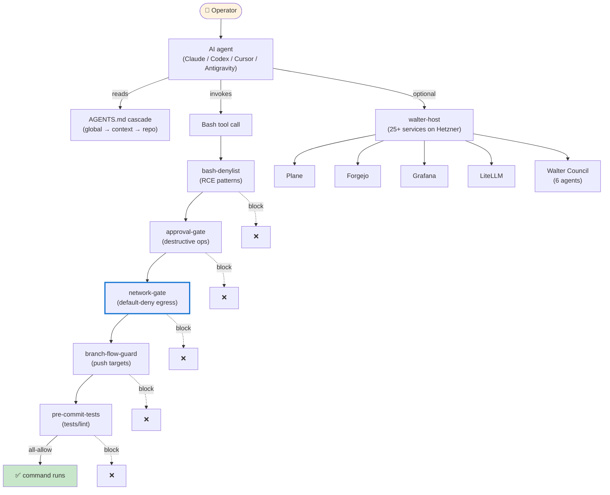
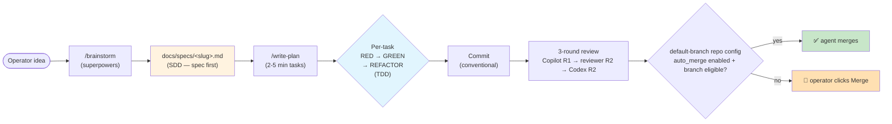

<div align="center">

# Walter-OS

**Self-hostable AI-agent operations framework with a default-deny security floor**

[](#license)
[](https://github.com/xipher-labs/walter-os/actions/workflows/ci.yml)
[](CHANGELOG.md)
[](CHANGELOG.md)
[](docs/operational/network-egress.md)

</div>

> **Status — alpha (v0.5.1).** Things iterate fast. **Pin to a tag** in production.
> Stability promise lands at v1.0 — see [the charter](docs/specs/walter-os-v1-0-stability-charter.md).
> Breaking changes between minor versions are normal until then; every release is tagged + documented in [CHANGELOG.md](CHANGELOG.md).

---

## What is this

Walter-OS is a single-repository operations framework that wires **Claude Code,
Codex CLI, Cursor, and Google Antigravity** under one agent contract, one
skills catalog, and one MCP configuration. All four tools read
[`AGENTS.md`](AGENTS.md) natively; Cursor and Antigravity ship adapter
generators (`install.sh --cursor-rules` / `--antigravity-rules`) for
environments that prefer a per-tool mirror.

The agent layer ships with a **default-deny security floor**: every
outbound network call an agent issues is blocked unless the target host is
in the operator's allowlist. Combined with bash-denylist (RCE patterns) and
approval-gate (destructive ops), it puts a non-trivial moat between
prompt-injection and the open internet.

A self-hosted service stack (`setup/walter-host/`) is optional — most
adopters never deploy it. The agent framework works fully without it.

### How it fits together



### Why

| If you want… | Walter-OS gives you… |
|---|---|
| Consistent agent behaviour across Claude / Codex / Cursor / Antigravity | One `AGENTS.md` cascade (global → context → repo), one skills library, one MCP profile |
| Defense against prompt-injection exfil | Default-deny network egress allowlist + bash-denylist + approval-gate hooks |
| Model choice by task strength | `WALTER_MODEL_*` routing preferences for Codex, Claude, Gemini aliases, and local Ollama |
| A reusable rigor + branch + review discipline | TDD-by-default, configurable branch flow, 3-round Copilot + Codex + reviewer-subagent loop |
| A homelab / self-hosted backend (optional) | 25+ services: Plane, Forgejo, Grafana, n8n, Infisical, LiteLLM, Caddy, Cloudflared, Headscale, … |
| A clear v1.0 stability promise | Four layers frozen at v1.0 with a deprecation policy + an executable conformance suite |

**Walter-OS is NOT** a zero-config starter kit. It's opinionated by design —
those opinions came from one operator's daily workflow, stripped of
personal config and hardened for adopters. If TDD discipline, branch flow,
3-round review, and a dual-license posture don't fit your style, fork +
diverge.

### Who is this for

Three primary personas. Read the "**NOT for you**" lines carefully — they
matter more than the positive ones.

#### 🛠 Builder — solo engineer, shipping product fast

- **For you if**: you write code most of the day; you context-switch between
  Claude Code / Codex CLI / Cursor / Antigravity / terminal; you want the
  same TDD + branch flow + 3-round review discipline on every PR without
  writing a CI pipeline.
- **NOT for you if**: you want a no-configuration experience; you need
  enterprise SSO / RBAC / audit trails; you're not comfortable with Docker
  and DNS + Linux sysadmin basics.
- **Pick**: Mode 1 (Lite) or Mode 2 (client install).

#### 🚀 Founder — pre-PMF, needs GTM tooling without a DevOps hire

- **For you if**: you want self-hosted PostHog + Postiz + n8n + Metabase
  without $300+/mo SaaS bills; you want AI agents that handle content +
  analytics + competitive research routed through your own LiteLLM gateway
  with cost visibility; you're OK spending a one-time 4-8 hour setup window.
- **NOT for you if**: you need uptime SLAs (single-VM setup); you want
  managed SaaS with customer support; your team is bigger than 2-3 people.
- **Pick**: Mode 2 + the founder-skills bundle, OR Mode 3 for the full
  GTM stack.

#### 🏠 Operator — homelab enthusiast, life-OS

- **For you if**: you want Syncthing + Headscale + Synapse/Element + Grafana
  in one composable stack; you think of your VM as an "always-on personal
  brain"; you want AI tools that respect privacy (secrets on your VM,
  PHI on a local LLM).
- **NOT for you if**: you want NAS-first setup; you want zero-downtime
  auto-updates (updates are manual `git pull` + `compose up`); you need
  mobile-first management.
- **Pick**: Mode 3 (self-hosted stack).

#### 🏁 Hackathon — time-boxed sprint mode (48h)

Set `WALTER_CONTEXT=hackathons` in your shell — the
[hackathon context](contexts/hackathons/AGENTS.md) drops rigor floors for
sprint mode. The [`hackathon-spinup`](skills/hackathon-spinup/SKILL.md)
skill orchestrates brand → landing → MVP → demo. Doesn't require the full
VM stack.

> 📖 **Deep dive**: [`docs/operational/personas.md`](docs/operational/personas.md)
> — the same three personas with longer NOT-for-you sections, explicit
> context-template paths, and the "relevant skills bundle" map.

---

## Install

Three installation modes; each builds on the previous. Pick where you want to stop.

### Mode 1 — Walter-OS Lite (30 seconds, no install)

Paste [`setup/agent-install/lite.md`](setup/agent-install/lite.md) into a Claude Code or Codex CLI conversation. Your agent adopts the minimum disciplines (rigor classification, TDD gate, conventional commits, branch flow, hard nevers) for that session. No file changes. No prerequisites.

To make it stick across all future sessions in the current repo (still no `install.sh`), paste [`setup/agent-install/lite-persist.md`](setup/agent-install/lite-persist.md) — it writes `.walter-os-lite/AGENTS.md` to the repo + adds it to `.gitignore`.

### Mode 2 — Client install (5 min)

Symlinks the agent contract, skills, commands, hooks, and `walter-os` CLI into `~/.claude/`, `~/.codex/`, and `~/.local/bin/`. No homelab required.

```bash
git clone https://github.com/xipher-labs/walter-os.git /opt/walter-os && cd /opt/walter-os
./install.sh --check               # verify minimum requirements (jq, yq, git, bats, docker)
./install.sh --dry-run             # preview every write before touching your config
./setup/personal-overlay-init.sh   # scaffold ~/.config/walter-os/overlay/
./install.sh --upgrade             # install/refresh symlinks + hooks + MCP profile
./install.sh --antigravity-rules   # optional: generate <repo>/.agent/rules/walter-os.md for Antigravity
./install.sh --cursor-rules        # optional: generate <repo>/.cursor/rules/walter-os.mdc for older Cursor
```

On first run, `install.sh` prompts to import the bundled egress allowlist (`contexts/_examples/egress-allowlist.example.txt`) so the network-gate hook isn't blocking GitHub / npm / pypi / the supported LLM APIs out of the box. Decline if you'd rather curate it yourself.

Pre-built agent prompts are at [`setup/agent-install/tier-1.md`](setup/agent-install/tier-1.md) and [`setup/agent-install/tier-2.md`](setup/agent-install/tier-2.md) — paste them into your agent if you'd rather have it run the install for you.

### Mode 3 — Self-hosted stack (1–2h, optional)

Deploys `setup/walter-host/`: a Docker compose stack with 25+ services behind Cloudflared + Caddy, secrets in Infisical, observability via Grafana/Loki/Prometheus, the Walter Council (6-agent autonomy layer), and the Control Tower UI.

Don't read this README for the full sequence — there are 15 steps with DNS, secrets bootstrap, and per-service first-run. Pre-built playbooks:

- [`setup/agent-install/tier-3.md`](setup/agent-install/tier-3.md) — Tier III prompt (~1–2 hrs, ~€25–50/mo on Hetzner)
- [`setup/agent-install/tier-4.md`](setup/agent-install/tier-4.md) — Tier IV adds Walter Council + automation (+~$10–50/mo LLM)

> 📖 **Deep dives**:
> [`operator-setup-runbook.md`](docs/operational/operator-setup-runbook.md) (full step-by-step) ·
> [`requirements.md`](docs/operational/requirements.md) (hardware + DNS + SSH) ·
> [`resource-budget.md`](docs/operational/resource-budget.md) (VM sizing per profile) ·
> [`stack-overview.md`](docs/operational/stack-overview.md) (service-by-service catalogue) ·
> [`walter-bridge.md`](docs/operational/walter-bridge.md) (LiteLLM + CLI clients) ·
> [`customization-patterns.md`](docs/operational/customization-patterns.md) (4-layer customization) ·
> [`troubleshooting.md`](docs/operational/troubleshooting.md) (22 symptom-cause-fix rows) ·
> [`n8n-workflows.md`](docs/operational/n8n-workflows.md) (6 bundled workflows).

---

## Quickstart (after Mode 2)

```bash
# Verify the install
walter-os doctor

# Inspect the egress allowlist + add a host you need
walter-os egress list
walter-os egress add api.openrouter.ai
walter-os egress test api.openrouter.ai   # → "allowed: api.openrouter.ai"

# Day-zero supply-chain audit (also runs on every fresh session)
walter-os audit

# Manage MCP profiles
walter-os profile default        # read-mostly, default
walter-os profile high-risk      # opt-in, money-spending + provisioning
```

A skill triggers when you describe the work it covers. For example, asking your agent to "spin up a new hackathon project" triggers [`hackathon-spinup`](skills/hackathon-spinup/SKILL.md); "review my UI" triggers [`web-design-guidelines`](skills/web-design-guidelines/SKILL.md). Full catalog: [`skills/INDEX.md`](skills/INDEX.md).

---

## Security floor (default-deny)

Every `Bash` tool call an agent issues passes through **five PreToolUse hooks**. All five must allow before the command runs. Each is fail-CLOSED on parse error, missing dependency, or unexpected input.

| Hook | Question it answers |
|---|---|
| [`bash-denylist.sh`](hooks/bash-denylist.sh)       | RCE patterns? (`curl X \| bash`, `eval $VAR`, `bash -c "$(…)"`, `rm -rf /`) |
| [`approval-gate.sh`](hooks/approval-gate.sh)       | Destructive op needing operator confirmation per the trust-tier matrix? |
| [`network-gate.sh`](hooks/network-gate.sh)         | Target host in `~/.config/walter-os/egress-allowlist.txt`? **Default-deny.** |
| [`branch-flow-guard.sh`](hooks/branch-flow-guard.sh) | Push violates configured branch flow (`single-tier` vs `three-stage`)? |
| [`pre-commit-tests.sh`](hooks/pre-commit-tests.sh) | Tests + lint + typecheck pass before commit? |

Daily supply-chain audit (`walter-os audit`) snapshots the SHA256 of every hook + the MCP server registry, diffs against baselines, and checks NVD for new CVEs in installed MCP servers. Hard-fails the next session if CVSS ≥ 7 findings are unresolved. Skill: [`skills/daily-supply-chain-audit/SKILL.md`](skills/daily-supply-chain-audit/SKILL.md).

> 📖 **Deep dive**: [`docs/operational/network-egress.md`](docs/operational/network-egress.md)
> — wildcard syntax, two-factor bypass, per-CLI host extraction
> (curl/wget/git/gh/ssh/scp/rsync/nc/pip/npm/uvx/cargo/brew/gem/go + git
> extensions lfs/svn/annex/p4 + shell wrappers/substitutions),
> known limitations.

---

## Disciplines

The core methodology is **SDD + TDD**: write the spec first, then drive
the implementation through tests. Disciplines stack like this:



| Discipline | What it means |
|---|---|
| **Rigor** | Every task classified `tiny` / `small` / `major` before work starts. Major needs a spec at `docs/specs/<slug>.md` + a `/write-plan` execution plan. |
| **SDD (Spec-Driven Development)** | No code without a spec. The spec at `docs/specs/<slug>.md` declares acceptance criteria up front; tests reference them by ID (`[AC-1]`); the `definition-of-done-validator` refuses to let the PR open until every AC has at least one test. |
| **TDD (Test-Driven Development)** | RED → GREEN → REFACTOR per task. The `test-driven-development` skill (from `obra/superpowers`) enforces it — skipping RED is a discipline violation. |
| **Branch flow** | Operator-configurable via `WALTER_BRANCH_FLOW`. Default `single-tier` (feature → main); opt-in `three-stage` (feature → dev → staging → main). Direct pushes to `main`/`master`/`staging`/`production` are blocked unconditionally. |
| **Review loop** | Copilot R1 → reviewer-subagent R2 → Codex R2 (standard, not fallback) → fix loop. Each round produces fix-commits referencing `Refs: copilot-review-round-N` / `codex-review-round-N` in the footer. |
| **Definition of Done** | Spec ACs map 1:1 to tests, all tests pass, lint/typecheck/format clean, security scan clean, reviewer-subagent approved. The [`definition-of-done-validator`](skills/definition-of-done-validator/SKILL.md) skill enforces this before PR. |
| **Merge policy** | **Default**: operator clicks merge. **Per-repo opt-in**: commit `walter-repo-config.yaml` with `auto_merge.enabled: true` and scoped `auto_merge.allowed_branches`. The policy file travels with the repo and replaces the retired touchfile approach. A PR that adds or loosens the file cannot authorize itself; future automation must read the default-branch policy that existed before the PR. See [`docs/operational/repo-config.md`](docs/operational/repo-config.md). |
| **Commit hygiene** | Conventional commits: `feat:` / `fix:` / `chore:` / `docs:` / `refactor:` / `test:` / `perf:` / `security:`. Body explains *why*; subject ≤ 72 chars imperative. |

PR titles use `[TYPE] -CATEGORY- title` (≤ 60 chars). CI gate: [`.github/workflows/pr-title-lint.yml`](.github/workflows/pr-title-lint.yml).

> 📖 **Deep dive**: `obra/superpowers` skills
> ([`brainstorming`](https://github.com/obra/superpowers) / `writing-plans` /
> `executing-plans` / `test-driven-development`) own the per-step methodology.
> The Walter-OS layer adds the spec template + the review-loop + the
> per-repo `walter-repo-config.yaml` policy surface.

---

## Catalogs

### Skills

~85 native skills under [`skills/`](skills/) + the [`obra/superpowers`](https://github.com/obra/superpowers) plugin (mandatory). Plugin install:

```
/plugin marketplace add obra/superpowers-marketplace
/plugin install superpowers@superpowers-marketplace
```

Full index: [`skills/INDEX.md`](skills/INDEX.md). Founder bundle: [`skills/founder-skills/INDEX.md`](skills/founder-skills/INDEX.md).

### MCP servers

22 servers in the canonical registry [`mcp/servers.json`](mcp/servers.json) — all default profile today (profile separation between default + high-risk is in flight in 2026-Q2 with the `risk_class` annotation pass).

Categories: dev tools (github, forgejo, sentry, playwright, maestro), project management (linear, plane), storage (filesystem, supabase), communication (slack, gmail), productivity (google_calendar, google_drive, notion), AI/infra (sequential_thinking, memory, brave_search), design (penpot), observability (grafana, elevenlabs), and three risk-class-flagged servers planned for the future manual profile (bitwarden, cloudflare, stripe).

### Agents

Six specialized agents under [`agents/`](agents/) form the Walter Council: reviewer (tier high), triage (medium), researcher (medium), coder (medium), liaison (low), janitor (low). Trust tiers configured at `~/.config/walter-os/trust-tiers.yml`. Council ops via `walter-os agents {list|run-once|pause|resume|status}`.

### Contexts

Four contexts auto-load based on cwd:

| Context | Cwd pattern | Template |
|---|---|---|
| **work** | `~/work/*` | [`contexts/work/AGENTS.md`](contexts/work/AGENTS.md) |
| **projects-personal** | `~/Projects-Personal/*` | [`contexts/projects-personal/AGENTS.md`](contexts/projects-personal/AGENTS.md) |
| **personal** | `~/personal/*` | [`contexts/personal/AGENTS.md`](contexts/personal/AGENTS.md) |
| **hackathons** | `WALTER_CONTEXT=hackathons` (env) | [`contexts/hackathons/AGENTS.md`](contexts/hackathons/AGENTS.md) |

The cascade resolves most-specific-wins: repo > context > global.

> 📖 **Deep dives**:
> [`operator-contexts.md`](docs/operational/operator-contexts.md) (cascade diagram + customization) ·
> [`skills/INDEX.md`](skills/INDEX.md) (full skills catalogue) ·
> [`mcp/servers.json`](mcp/servers.json) (canonical MCP registry) ·
> [`agents/`](agents/) (Walter Council definitions).

---

## Configuration

The operator's personal overlay lives at `~/.config/walter-os/overlay/` (private, out-of-repo). Scaffold it with `./setup/personal-overlay-init.sh`. The most-edited files:

| Path | What it does |
|---|---|
| `~/.config/walter-os/overlay/personal.env` | Env vars (`WALTER_DOMAIN`, `WALTER_BRANCH_FLOW`, `WALTER_CONTEXT`, …) |
| `~/.config/walter-os/overlay/contexts/<ctx>/AGENTS.md` | Per-context AGENTS.md override (loads instead of the repo template) |
| `~/.config/walter-os/overlay/preferences.md` | Tooling preferences (shell, package managers, editor, container runtime) |
| `~/.config/walter-os/egress-allowlist.txt` | Network egress allowlist — `walter-os egress {add,remove,list,test,import}` to manage |
| `~/.config/walter-os/trust-tiers.yml` | Per-agent trust tier for Council `approval-gate.sh` |

`WALTER_BRANCH_FLOW` accepts `single-tier` (default) or `three-stage`. See [docs/decisions/0013-solo-operator-merge-policy.md](docs/decisions/0013-solo-operator-merge-policy.md) for the trade-offs.

> 📖 **Deep dive**: [`customization-patterns.md`](docs/operational/customization-patterns.md)
> (4 layers: per-service / profiles / per-skill / per-context) ·
> [`operator-contexts.md`](docs/operational/operator-contexts.md) (env-var reference) ·
> [`contexts/_examples/`](contexts/_examples/) (real-world templates).

---

## Uninstall

`install.sh` writes symlinks. `--uninstall` removes them AND restores the operator's pristine pre-Walter-OS `.md` files from the oldest `.pre-walter-os.<ts>` backup.

```bash
# From the cloned repo:
./install.sh --uninstall                # interactive — prompts before restoring

# Or via the CLI (works after install, even if you've moved the clone):
walter-os uninstall                     # equivalent
walter-os uninstall --restore-backups   # non-interactive: always restore
walter-os uninstall --no-restore-backups # non-interactive: skip restore (operator's backups stay on disk)
```

What gets removed:

- Symlinks under `~/.claude/` and `~/.codex/` pointing into the Walter-OS clone.
- Hook entries in `~/.claude/settings.json` tagged with `_walter_os: true`.
- The daily-audit launchd / systemd timer.

What gets restored (when `--restore-backups` is the chosen path):

- The OLDEST `.pre-walter-os.<ISO-8601-Z>.<unix>` backup of `CLAUDE.md` / `AGENTS.md` becomes the live file again (that's your pristine pre-Walter-OS content). Newer backups (`.pre-walter-os.<n>.2` etc.) accumulated across upgrades are cleaned up.

What is left alone:

- `~/.config/walter-os/` (your personal overlay + egress allowlist + audit baselines).
- The cloned repo itself (`/opt/walter-os` or wherever you cloned it).
- Your Docker compose stack from `setup/walter-host/` (run `docker compose down` separately if you deployed Mode 3).

**Non-TTY default is SAFE**: in headless contexts (CI / pipe / scripted), the uninstall skips restore + emits the manual `mv` command instead of silently deleting operator backups. Pass `--restore-backups` explicitly to force restore in non-interactive runs.

Tracking issue: [#191](https://github.com/Xipher-Labs/walter-os/issues/191).

---

## Further reading

The README only covers the top of the funnel. Deep-dive docs by topic:

| Topic | Doc |
|---|---|
| Detailed personas (with "NOT for you" sections) | [`docs/operational/personas.md`](docs/operational/personas.md) |
| Self-hosted stack catalogue (25+ services) | [`docs/operational/stack-overview.md`](docs/operational/stack-overview.md) |
| VM sizing per profile combo | [`docs/operational/resource-budget.md`](docs/operational/resource-budget.md) |
| LiteLLM gateway + CLI client setup | [`docs/operational/walter-bridge.md`](docs/operational/walter-bridge.md) |
| Default-deny egress allowlist guide | [`docs/operational/network-egress.md`](docs/operational/network-egress.md) |
| Customization patterns (4 layers) | [`docs/operational/customization-patterns.md`](docs/operational/customization-patterns.md) |
| Symptom-cause-fix troubleshooting | [`docs/operational/troubleshooting.md`](docs/operational/troubleshooting.md) |
| n8n workflow catalogue | [`docs/operational/n8n-workflows.md`](docs/operational/n8n-workflows.md) |
| Full step-by-step VM install | [`docs/operational/operator-setup-runbook.md`](docs/operational/operator-setup-runbook.md) |
| Second-device / teammate onboarding | [`docs/operational/onboarding-planner.md`](docs/operational/onboarding-planner.md) |
| Operator contexts cascade | [`docs/operational/operator-contexts.md`](docs/operational/operator-contexts.md) |
| Multi-device sync (Syncthing) | [`docs/operational/multi-device-sync.md`](docs/operational/multi-device-sync.md) |
| Control Tower runbook | [`docs/operational/control-tower-runbook.md`](docs/operational/control-tower-runbook.md) |
| ADRs (architecture decisions) | [`docs/decisions/`](docs/decisions/) |
| Feature specs + implementation plans | [`docs/specs/`](docs/specs/) |

For "how do I get help?" → [SUPPORT.md](SUPPORT.md).

---

## Updates

Routine update (monthly recommended):

```bash
walter-os upgrade             # local checkout + install.sh --upgrade + audit + doctor
```

Preview first when you want to see every command before it mutates anything:

```bash
walter-os upgrade --dry-run
```

For the Walter-VM host, update the remote Walter-OS checkout/config explicitly:

```bash
walter-os upgrade --all --snapshot --yes
```

`--snapshot` is opt-in because VM snapshots may cost money, and non-dry-run
snapshot upgrades require `--yes`.

Docker service rollouts are never automatic. Name each service explicitly so a
framework update does not silently migrate databases or restart production
containers:

```bash
walter-os upgrade --all --service n8n
```

Explicit service rollouts go through the existing `walter deploy <service>`
path, so service-specific config sync and `.env` exclusions still apply.

Major version bumps may include breaking changes — read the [CHANGELOG](CHANGELOG.md) entry for the target version before pulling. To pin an upgrade to a tagged release:

```bash
walter-os upgrade --target v0.6.0
```

The `quarterly-upgrade-cadence` skill formalizes the pre-bump snapshot + tier-by-tier rollout + rollback procedure.

Rollback: `git checkout <prev-tag>` + `./install.sh --upgrade`. Symlinks are re-pointed atomically.

---

## Repo structure

```
walter-os/
├── AGENTS.md                    # Global agent contract (loaded by all four tools)
├── CHANGELOG.md                 # SemVer changelog
├── VERSION                      # Single-source semver (0.5.1)
├── LICENSE                      # AGPL-3.0-or-later (canonical text)
├── LICENSE-APACHE               # Apache-2.0 (canonical text — default tree)
├── NOTICE                       # Operator attribution + dual-license map
├── COMMERCIAL.md                # Entry point for commercial-license requests
├── SECURITY.md                  # Responsible-disclosure policy + supported versions
├── agents/                      # Walter Council agent definitions
├── apps/control-tower/          # Next.js 16 Council UI (docker build'd)
├── bin/                         # walter-os admin CLI + walter daily-driver CLI
├── commands/                    # Slash commands (/brainstorm, /write-plan, /execute-plan)
├── contexts/{work,projects-personal,personal,hackathons}/AGENTS.md  # Context templates
├── docs/{decisions,operational,specs}/                              # ADRs, runbooks, specs
├── external/{marchetto,vercel}-agent-skills/                        # Submodules (SHA-pinned)
├── hooks/                       # PreToolUse chain: bash-denylist, approval-gate, network-gate, branch-flow-guard, pre-commit-tests
├── install.sh                   # Install / upgrade / uninstall + adapter generators
├── mcp/servers.json             # Canonical MCP registry (22 servers)
├── scripts/walter/lib/          # Shell libs sourced by hooks (env-loader, egress-loader, version-compare)
├── setup/walter-host/           # Optional self-hosted stack (Cloudflared, Caddy, per-service compose)
├── setup/agent-install/         # Tier I-IV agent-led install playbooks
├── skills/                      # ~85 native skills
├── tests/{audit,cli,hooks,install,oss,walter}/                      # Bats suites
└── wiki/                        # LLM-maintained operator knowledge base (frontmatter-validated)
```

Full architecture overview: [`docs/operational/walter-os-vs-walter-host.md`](docs/operational/walter-os-vs-walter-host.md).

---

## Contributing

PRs welcome — [CONTRIBUTING.md](CONTRIBUTING.md) is the convention reference (commit format, PR title format, review-loop expectations). For large changes, open an issue first to discuss the spec before opening the PR.

Reproducible bugs on non-reference platforms, depersonalization leaks, security findings, and "this confused me the first time" doc gaps are especially appreciated. Security disclosures go through [SECURITY.md](SECURITY.md) — do **not** file public issues for vulnerabilities.

The repo is signed by the maintainer's GPG key; contributors don't need to sign. A [CLA](CLA.md) is required for merge — the CLA-assistant bot handles it on the first PR.

Reference platforms: macOS (Apple Silicon) + Hetzner Cloud Ubuntu 24.04. Other Linux dev workstations should work. Windows / WSL is unverified.

---

## License

Dual-licensed by directory tree:

| Tree | License | SPDX |
|---|---|---|
| Default (everything outside `setup/walter-host/`) | Apache License 2.0 | `Apache-2.0` |
| `setup/walter-host/` | GNU AGPL v3 (or later) | `AGPL-3.0-or-later` |

**Implications**: build proprietary products on the agent contract layer (skills / agents / hooks / `AGENTS.md`) without obligation to publish; modifications to the homelab stack deployed as a network service must be published under AGPL (§13 trigger). Self-hosting on your own infrastructure for your own use carries no obligation under either license.

Files carry SPDX headers (`# SPDX-License-Identifier: Apache-2.0` or `# SPDX-License-Identifier: AGPL-3.0-or-later` for the AGPL subtree). Canonical texts: [`LICENSE`](LICENSE), [`LICENSE-APACHE`](LICENSE-APACHE), [`setup/walter-host/LICENSE`](setup/walter-host/LICENSE).

Commercial licenses (OEM/embedding, closed-source modifications of the host stack as a service, trademark grants): `licensing@xipherlabs.xyz` or [COMMERCIAL.md](COMMERCIAL.md). The legal entity is being constituted per [ADR-0022](docs/decisions/0022-xipher-labs-legal-entity.md); the founding operator is the sole copyright holder of record in the interim.

---

## Brand + origin

Walter-OS is created by **Xipher Labs** and started as the personal operations
framework of [@f0x1777](https://github.com/f0x1777). After using it across
real projects, enough reusable value emerged to open-source it via Xipher Labs
with the operator-personal pieces stripped out and the workflows hardened for
adopters.

Forkers are encouraged to replace the Xipher Labs attribution with their own
organization in their fork's README + NOTICE file. The name "Walter-OS" may
be retained with attribution per the `NOTICE` file terms.

---

<div align="center">
<sub>Walter-OS by Xipher Labs — Build with discipline, ship with confidence.</sub>
</div>
