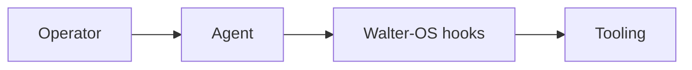

# README Craft — Recommended tools

> **Last reviewed**: 2026-05-21 (re-audit quarterly per AGENTS.md
> "quarterly-upgrade-cadence").
>
> **Upstream**: [`dhyeythumar/awesome-readme-tools`](https://github.com/dhyeythumar/awesome-readme-tools)
> (CC0-1.0). Upstream catalogs ~55 tools; this file is Walter-OS's
> opinionated subset. **8 tools** total — fewer choices, faster
> decisions.
>
> **How to read this file**: agent invocations of `readme-craft` should
> consult this list first when picking a concrete tool. If nothing here
> fits the operator's need, fall back to the upstream catalog. Adding a
> tool here requires an ADR-style rationale in the entry; removing one
> requires a quarterly-audit note.

---

## Editorial criteria

A tool earns a spot here when ALL of these hold:

1. **Signal over decoration.** It answers a question a reader would
   actually ask (see SKILL.md → "Badges — what is signal vs what is
   decoration").
2. **Actively maintained** — commit within the last 6 months on the
   upstream repo OR the service is operated by a trusted vendor
   (GitHub, Vercel-hosted by a known maintainer, etc.).
3. **Supply-chain hygiene possible** — GitHub Actions are pinnable to
   a commit SHA; SVG endpoints come from a host the operator already
   trusts; query strings can be locked.
4. **Not a known anti-pattern** per SKILL.md (no visitor counters,
   no decorative "streak" badges, no AI-generated prose).
5. **License compatible** — MIT/Apache/CC0/BSD/0BSD. Anything custom
   or non-commercial is rejected.

A tool gets removed when ANY of these flip.

---

## 1. Badges → Shields.io

| Field | Value |
|---|---|
| Upstream entry | https://github.com/badges/shields |
| Service URL | https://shields.io |
| License | CC0-1.0 |
| Status | Maintained; the reference badge service since ~2014. |

**Use when**: you need any badge under the title (CI status, latest
version, license, coverage, community). Shields covers nearly every
data source you'd want.

**Avoid when**: never — there is no better alternative. If you find
yourself reaching for a non-Shields badge service, the answer is "fewer
badges", not "different provider".

**Supply-chain notes**: SVG is served from `img.shields.io`. Hard-code
specific badge styles in the URL (`?style=flat-square&logoColor=white`)
so the rendered output doesn't drift if Shields changes defaults. Cache
the badge in your repo (`docs/assets/badges/`) if you need 100%
reproducibility — most projects don't.

---

## 2. Statistical widget (profile READMEs only) → GitHub Readme Stats

| Field | Value |
|---|---|
| Upstream entry | https://github.com/anuraghazra/github-readme-stats |
| Service URL | https://github-readme-stats.vercel.app |
| License | MIT |
| Status | 70k+ stars; maintained by Anuraghazra + community. |

**Use when**: building a **profile** README (the `username/username`
repo) and you want ONE stats card. Pick the "Top Languages" card OR the
"GitHub Stats" card, not both.

**Avoid when**: project READMEs (project READMEs serve different
readers — collaborators want the install, not your contribution graph).
Also avoid the "streak" variants — they encode vanity metrics that
penalize taking weekends off.

**Supply-chain notes**: SVG endpoint is hosted on Vercel by the
maintainer. Lock the query string explicitly: `&hide_border=true&theme=default&include_all_commits=true&count_private=false`.
Re-audit quarterly that the maintainer hasn't transferred the deploy.

**Known intermittent**: the public Vercel endpoint
(`github-readme-stats.vercel.app`) periodically returns HTTP 503 under
load. Profile READMEs that depend on it render with a broken image during
those windows. Mitigation: self-deploy the project to your own Vercel
account (free tier covers it) and point the README at your fork. This
moves the supply-chain trust boundary to your own deploy.

---

## 3. Statistical widget alternative (developer time) → Waka Readme

| Field | Value |
|---|---|
| Upstream entry | https://github.com/athul/waka-readme |
| License | MIT |
| Status | Active; widely deployed. |

**Use when**: you actually track time with [Wakatime](https://wakatime.com)
and the time-spent-coding signal is meaningful to your audience (e.g.
showing "this week: 32 hrs Rust, 8 hrs TypeScript" on a contractor's
profile to signal language fluency).

**Avoid when**: you don't already use Wakatime — installing it just to
generate the widget is a tail wagging the dog.

**Supply-chain notes**: runs as a GitHub Action. **Pin to a specific
commit SHA**, never to `@v1` or `@master`. The action has write access
to the README — supply chain compromise = README defacement.

---

## 4. GitHub Action (recent activity) → github-activity-readme

| Field | Value |
|---|---|
| Upstream entry | https://github.com/jamesgeorge007/github-activity-readme |
| License | MIT |
| Status | 4k+ stars; maintained. |

**Use when**: a profile README where "currently working on" rotates
faster than quarterly. The action updates a `<!--START_SECTION:activity-->`
block with recent events (opened PRs, pushed commits, etc.).

**Avoid when**: project READMEs (irrelevant), or profile READMEs you
update by hand every quarter (the static text is more deliberate and
ages better).

**Supply-chain notes**: Pin to SHA. Set permissions in the workflow to
`contents: write` only on the profile repo, nothing else. Audit the
action's source before pinning a new version.

---

## 5. GitHub Action (latest blog posts) → Blog Post Workflow

| Field | Value |
|---|---|
| Upstream entry | https://github.com/gautamkrishnar/blog-post-workflow |
| License | MIT |
| Status | 3k+ stars; actively maintained. |

**Use when**: you write a blog at a personal domain (Hashnode, dev.to,
custom, etc.) and want the latest N posts surfaced on your profile
README. Sources: RSS, Atom, Mastodon, StackOverflow.

**Avoid when**: you don't actually write often. A workflow that pulls
"latest blog post: 14 months ago" is worse than no widget.

**Supply-chain notes**: Pin to SHA. The action runs on a schedule and
fetches from external URLs — review the RSS feeds you point it at
(don't aggregate a blog you don't control).

---

## 6. README generator (skeleton only, exceptional use) → rahuldkjain Profile Readme Generator

| Field | Value |
|---|---|
| Upstream entry | https://github.com/rahuldkjain/github-profile-readme-generator |
| Service URL | https://rahuldkjain.github.io/gh-profile-readme-generator/ |
| License | MIT |
| Status | 22k+ stars; mostly maintained. |

**Use when**: you've never written a profile README and cannot picture
the section structure. Use the generator to produce the SKELETON only —
copy the empty section headings into your editor, then write each section
from scratch following SKILL.md → "Profile README".

**Avoid when**:
- Project READMEs (this is profile-only).
- You already have any profile draft, even a bad one (editing your
  draft beats reading the generator's).
- You'd be tempted to keep the generated prose. **Never ship generator
  prose.** The skill's hard rule.

**Supply-chain notes**: Web app, no install. Run it once for the
outline, then close the tab. Do not embed any generated tracking links.

---

## 7. Tech icons (NOT badges, for hero images) → Simple Icons

| Field | Value |
|---|---|
| Upstream entry | https://github.com/simple-icons/simple-icons |
| Service URL | https://simpleicons.org |
| License | CC0-1.0 |
| Status | 11k+ stars; very actively maintained. |

**Use when**: hackathon submission READMEs where the "tech stack"
section benefits from a small visual row, OR a hero image collage on a
project README that legitimately involves several technologies (e.g.
"polyglot SDK supporting Rust + TypeScript + Python").

**Avoid when**:
- As badges under the title ("Made with React + Tailwind + Vite" stack
  is a known anti-pattern in SKILL.md). Use prose: "Built with React +
  Tailwind."
- For decoration only. The icons should reinforce a sentence the prose
  already makes, not replace it.

**Supply-chain notes**: SVGs served from `cdn.simpleicons.org` or
self-hostable from the repo. Self-host if you care about uptime.

---

## 8. Diagrams (NOT in upstream, but essential) → Mermaid

| Field | Value |
|---|---|
| Source | https://mermaid.js.org/ |
| Service URL | GitHub renders Mermaid natively in Markdown since 2022 |
| License | MIT |
| Status | Maintained by the Mermaid community + GitHub. |

**Use when**: project README needs an architecture diagram, sequence
diagram, ER diagram, or simple flowchart inline. Mermaid blocks render
on github.com without any external image hosting — supply-chain
nightmare avoided.

**Avoid when**:
- The diagram is complex enough that Mermaid produces unreadable
  output. Use Excalidraw or Drawio and embed the image then.
- The diagram is a one-time architecture overview better placed in a
  separate `docs/architecture.md` (link from README, don't inline).

**Supply-chain notes**: Native GitHub feature, no external service.
Lowest supply-chain risk of any visual tool listed here.

Example block (renders directly in README):

````

````

---

## What we explicitly skipped (and why)

For transparency — operators reaching for these will hit the SKILL.md
rules. Documented so the agent can cite the reasoning when refusing.

| Tool | Why skipped |
|---|---|
| **GitHub Readme Streak Stats** | "Streak" = vanity metric that penalizes weekends off. Anti-pattern in SKILL.md. |
| **Isometric Contributions / GitHub Contributions Chart** | Decorative; no signal. Stacking visualizations of the same metric is in the anti-patterns list. |
| **Hits / Visitor Badge** | Visitor counters log IPs of every reader → privacy issue + signal nothing about quality. Anti-pattern. |
| **Markdown Badges** | Just a list of static tech-logo SVGs. "Tech-used badges" are an anti-pattern. |
| **GitClear widgets** | Free tier of a paid SaaS — adds an external dependency and an asymmetric incentive (vendor wants you to upgrade). Self-hostable alternatives exist. |
| **Coolreadme / any AI generator** | AI-generated prose is the opposite of what this skill recommends. Throwaway only for skeleton, see Tool #6. |
| **GitHub Profile Trophy / Readme Quotes / Jokes / Random Memer** | "Trying too hard" — anti-pattern. The README is not the operator's personality slot. |
| **Spotify/Twitter/Medium/LinkedIn embeds** | Niche — only useful when the embedded platform is core to the operator's domain. Defer to operator's judgment for that case. |
| **Header image generators (REHeader, leviarista)** | Stock-photo banners look unserious (anti-pattern). Hand-craft the hero or skip it. |
| **Get Readme / NRG / Plantek README Manager** | Low adoption (<100 stars each), generic generators that don't beat writing from scratch. |

---

## Re-audit checklist (quarterly)

Run this checklist when `quarterly-upgrade-cadence` skill triggers, OR
when `daily-supply-chain-audit` flags an issue with any tool here:

- [ ] All 8 upstream URLs return 200 (run the bats test in
  `tests/recommended-tools-urls.bats`).
- [ ] Each upstream's last commit is within the last 6 months.
- [ ] None of the GitHub Actions have published a new major version
  without a security advisory.
- [ ] No new tool in the upstream catalog deserves promotion to this
  list (review the upstream's recent additions).
- [ ] No tool here has been deprecated or transferred to a less-trusted
  maintainer.

Update the "Last reviewed" date at the top after each audit.
